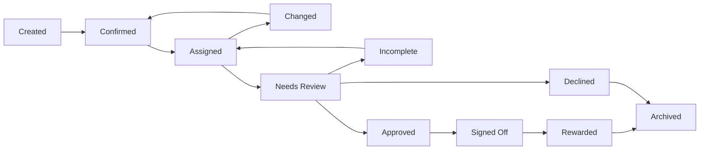

# Matou Contributions System - Product Design Document

**Version:** 1.0
**Date:** February 2026
**Status:** Design Specification for Implementation Planning

---

## Table of Contents

1. [Executive Summary](#1-executive-summary)
2. [System Overview](#2-system-overview)
3. [Governance Features](#3-governance-features)
4. [Planning Mechanisms](#4-planning-mechanisms)
5. [Contributions Management System](#5-contributions-management-system)
6. [Technical Data Model](#6-technical-data-model)
7. [Tokenomics Integration](#7-tokenomics-integration)
8. [Process Flows](#8-process-flows)
9. [Roles and Responsibilities](#9-roles-and-responsibilities)
10. [Design Principles](#10-design-principles)
11. [Development Considerations](#11-development-considerations)
12. [References](#12-references)

---

## 1. Executive Summary

### 1.1 Purpose

The Matou Contributions System is a comprehensive platform for managing decentralized work within the Matou DAO ecosystem. It enables community members to propose, plan, execute, and be rewarded for contributions that advance the collective's goals while maintaining cultural alignment and governance transparency.

### 1.2 Core Value Proposition

- **Cultural Alignment**: All contributions respect and advance Indigenous cultural values through Elder oversight
- **Democratic Governance**: Three-house model ensures balanced decision-making across cultural, strategic, and operational domains
- **Fair Compensation**: Multi-token reward system (CTR, UTIL, COM) with quality-based multipliers
- **Transparent Operations**: On-chain recording of all governance actions and contribution tracking
- **Scalable Automation**: Machine-readable data structures enable automated workflows and retroactive value recognition

### 1.3 Key Stakeholders

| Stakeholder | Primary Interest |
|-------------|------------------|
| Community Members | Propose ideas, participate in governance |
| Contributors | Complete work, earn rewards |
| Proposal Leads | Own and shepherd proposals through governance |
| Proposal Stewards | Peer-review proposals and sign off decision plans |
| Project Stewards | Manage implementation of approved proposals |
| Treasury Stewards | Oversee fund allocation and reward distribution |
| Elder Council | Ensure cultural alignment, veto power |
| Community Representatives | Strategic direction, budget priorities |

---

## 2. System Overview

### 2.1 System Architecture

The Contributions System operates as an integrated platform connecting:

```
┌─────────────────────────────────────────────────────────────────────┐
│                     GOVERNANCE LAYER                                │
│  ┌───────────────┐  ┌────────────────┐  ┌────────────────────────┐  │
│  │ Elder Council │  │ Community House│  │ Contributor House      │  │
│  │ (Cultural)    │  │ (Strategic)    │  │ (Operational)          │  │
│  └───────────────┘  └────────────────┘  └────────────────────────┘  │
└─────────────────────────────────────────────────────────────────────┘
                                 │
┌─────────────────────────────────────────────────────────────────────┐
│                   PROPOSAL & PLANNING LAYER                         │
│  ┌────────────────┐  ┌────────────────┐  ┌────────────────────────┐ │
│  │ Proposals      │  │ Decision Plans │  │ Endorsements           │ │
│  └────────────────┘  └────────────────┘  └────────────────────────┘ │
└─────────────────────────────────────────────────────────────────────┘
                                 │
┌─────────────────────────────────────────────────────────────────────┐
│                      PROJECT LAYER                                  │
│  ┌────────────────┐  ┌────────────────┐  ┌────────────────────────┐ │
│  │ Projects       │  │ Implementation │  │ Milestones             │ │
│  │                │  │ Plans          │  │                        │ │
│  └────────────────┘  └────────────────┘  └────────────────────────┘ │
└─────────────────────────────────────────────────────────────────────┘
                                 │
┌─────────────────────────────────────────────────────────────────────┐
│                  CONTRIBUTIONS LAYER                                │
│  ┌────────────────┐  ┌────────────────┐  ┌────────────────────────┐ │
│  │ Contribution   │  │ Nested         │  │ Evidence &             │ │
│  │ Requests       │  │ Contributions  │  │ Validation             │ │
│  └────────────────┘  └────────────────┘  └────────────────────────┘ │
└─────────────────────────────────────────────────────────────────────┘
                                 │
┌─────────────────────────────────────────────────────────────────────┐
│                    TREASURY LAYER                                   │
│  ┌────────────────┐  ┌────────────────┐  ┌────────────────────────┐ │
│  │ Fund Allocation│  │ Reward         │  │ Token Mint/Burn        │ │
│  │                │  │ Distribution   │  │                        │ │
│  └────────────────┘  └────────────────┘  └────────────────────────┘ │
└─────────────────────────────────────────────────────────────────────┘
```

### 2.2 Core Entities

| Entity | Description | Documentation |
|--------|-------------|---------------|
| **Proposal** | Request for resource allocation or operational change | [Proposal Schema](../matou-docs/docs/technical/schemas/proposal-schema.md) |
| **Decision Plan** | Governance actions required for proposal approval | [Decision Plan Schema](../matou-docs/docs/technical/schemas/decision-plan-schema.md) |
| **Governance Action** | Official actions by governance houses | [Governance Action Schema](../matou-docs/docs/technical/schemas/governance-action-schema.md) |
| **Project** | Container managing context for contributions, linked to one or more proposals | Section 4.3 |
| **Implementation Plan** | Project milestones and contribution breakdown | [Implementation Plan Schema](../matou-docs/docs/technical/schemas/implementation-plan-schema.md) |
| **Contribution** | Individual work unit with rewards | [Contribution Schema](../matou-docs/docs/technical/schemas/matou-contribution-schema.md) |
| **Treasury Action** | Financial transactions and distributions | [Treasury Action Schema](../matou-docs/docs/technical/schemas/treasury-action-schema.md) |

---

## 3. Governance Features

### 3.1 Three-House Governance Model

The system implements a polycentric governance structure with three distinct houses, each with specialized authority:

#### 3.1.1 Elder Council

**Purpose**: Maintains collective culture and values

| Feature | Description |
|---------|-------------|
| **Composition** | Community elders, cultural and spiritual leaders |
| **Authority** | Cultural veto power on all proposals |
| **Voting Type** | Veto vote (binary: veto/no-veto) |
| **Decision Focus** | Cultural alignment, tikanga, spiritual values |

**Process Integration**:
- Receives all proposals after initial review
- Facilitates cultural discussion via proposal lead
- Exercises veto power within defined timeframe
- Provides cultural feedback and guidance

#### 3.1.2 Community House

**Purpose**: Sets vision, strategies, and treasury priorities

| Feature | Description |
|---------|-------------|
| **Composition** | Tribal and Community Representatives ($COM holders) |
| **Authority** | Strategic decisions, budget allocation |
| **Voting Type** | Quadratic voting with cardinal expression |
| **Quorum** | 20% of total community representatives or $COM |

**Decision Types**:
- Strategic alignment approval
- Budget priority decisions
- Community representation matters
- Partnership agreements

#### 3.1.3 Contributor House

**Purpose**: Executes strategies and manages operations

| Feature | Description |
|---------|-------------|
| **Composition** | Active contributors ($CTR holders) |
| **Authority** | Operational and technical decisions |
| **Voting Type** | Quadratic voting with cardinal expression |
| **Quorum** | 10% of total contributors or $CTR |

**Decision Types**:
- Technical feasibility assessment
- Budget reasonableness
- Implementation plan approval
- Operational parameters

### 3.2 Governance Features Matrix

| Feature | Description | Implementation |
|---------|-------------|----------------|
| **Democratic** | Community-driven decisions | Member-based voting in Community and Contributor Houses |
| **Polycentric** | Distributed decision centers | Three-house model with distinct powers |
| **Culturally Grounded** | Indigenous values integration | Elder review and veto power |
| **Quadratic** | Non-linear voting power | Prevents dominance by large token holders |
| **Cardinal** | Passion expression | Voters choose voting power allocation |
| **On-chain** | Blockchain transparency | All actions recorded on-chain |

**Reference**: [Governance Model](../matou-docs/docs/operations/governance/governance.md)

### 3.3 Voting Mechanisms

#### 3.3.1 Quadratic Voting

Voting power scales as the square root of tokens held:
- `Voting Power = √(tokens held)`
- Prevents plutocracy while rewarding contribution
- Allows expression of preference intensity

#### 3.3.2 Cardinal Voting

Voters can express support intensity:
- Choose how much voting power to spend per proposal
- Support OR oppose a proposal
- Accumulate voting power over time

#### 3.3.3 Veto Voting (Elder Council)

Binary decision mechanism:
- Cultural alignment check
- Any elder can initiate veto discussion
- Veto blocks proposal from proceeding

**Reference**: [Voting Mechanisms](../matou-docs/docs/knowledge/resources/voting-mechanisms.md)

---

## 4. Planning Mechanisms

### 4.1 Proposal Planning

#### 4.1.1 Proposal Structure

Every proposal must contain:

| Field | Type | Required | Description |
|-------|------|----------|-------------|
| `id` | UUID | Yes | Unique identifier |
| `proposer_id` | UUID | Yes | ID of the member who created the proposal |
| `title` | String | Yes | Proposal title |
| `type` | Enum[] | Yes | Classification (technical, community, governance, operations) |
| `priority` | Enum | Yes | Priority level (low, medium, high, critical) |
| `description` | Text | Yes | Detailed description |
| `problem_statement` | Text | Yes | Problem being addressed |
| `solution` | Text | Yes | Proposed solution |
| `expected_outcomes` | Array | Yes | Expected results |
| `estimated_budget` | String | Yes | Budget estimate |
| `timeline` | String | Yes | Project timeline |
| `project_plan` | Array | No | Detailed milestones and contributions |

#### 4.1.2 Proposal Status Lifecycle

```
draft → submitted → endorsing → in_review → signed_off → voting_process → approved/rejected → completed
```

| Status | Description | Next Actions |
|--------|-------------|--------------|
| `draft` | Proposal being created | Complete and submit |
| `submitted` | Proposal submitted for community endorsement | Proposer engages community for endorsements |
| `endorsing` | Collecting member endorsements | Community members endorse the proposal |
| `in_review` | Under proposal lead review (endorsement threshold met) | Review completeness, assign proposal steward |
| `signed_off` | Ready for voting | Begin voting process |
| `voting_process` | Going through houses | Complete all house votes |
| `approved` | All houses approved | Begin implementation |
| `rejected` | One or more houses rejected | No further action |
| `completed` | Implementation finished | Archive |

#### 4.1.3 Member Endorsements

After submission, proposals enter a community endorsement phase. Endorsements are recorded in an **any-sync data tree** associated with the proposal, enabling peer-to-peer synchronization of endorsement activity across all nodes.

**How endorsements work:**
1. The proposer shares the submitted proposal with the community
2. Community members review the proposal and may **endorse** it by recording an endorsement action in the proposal's any-sync tree
3. Each endorsement is signed by the member's key within any-sync, providing authenticity
4. Once the required endorsement threshold is met, the proposal advances to `in_review`

**Endorsement data recorded per action:**
| Field | Type | Description |
|-------|------|-------------|
| `endorser_id` | UUID | ID of the endorsing member |
| `endorsed_at` | ISO 8601 | Timestamp of endorsement |
| `comment` | Text | Optional endorsement comment |

**Design rationale:** Endorsements use an any-sync object tree rather than individual KERI credentials. This keeps endorsements lightweight, leverages existing P2P sync infrastructure, and avoids the overhead of creating a separate AID per proposal. Endorsement data syncs automatically across peers and is auditable through the tree's change history.

**Reference**: [Proposal Schema](../matou-docs/docs/technical/schemas/proposal-schema.md)

### 4.2 Decision Plan

Decision plans define the governance path for each proposal:

#### 4.2.1 Structure

| Field | Type | Description |
|-------|------|-------------|
| `id` | UUID | Plan identifier |
| `proposal_id` | UUID | Associated proposal |
| `title` | String | Decision plan title |
| `description` | Text | Overview of governance actions |
| `status` | Enum | Plan status: drafted, submitted, signed_off |
| `objectives` | Array | Goals for each house |
| `expected_outcomes` | Array | Desired decisions |
| `governance_actions` | Array | List of governance actions |
| `proposal_lead_id` | UUID | Assigned proposal lead |
| `proposal_steward_id` | UUID | Peer reviewer proposal steward |

#### 4.2.1a Decision Plan Status Lifecycle

```
drafted → submitted → signed_off
```

| Status | Description | Next Actions |
|--------|-------------|--------------|
| `drafted` | Decision plan being created by proposal lead | Complete and submit for review |
| `submitted` | Submitted for review by proposal steward | Proposal steward reviews and signs off |
| `signed_off` | Signed off by proposal steward | Proceed to voting process |

#### 4.2.2 Governance Actions

Each decision plan contains multiple governance actions:

| Field | Type | Description |
|-------|------|-------------|
| `id` | UUID | Action identifier |
| `decision_plan_id` | UUID | Associated decision plan |
| `house` | Enum | Target house (elders_council, community_reps, contributors) |
| `action_type` | Enum | Type (discussion, decision, meeting) |
| `description` | Text | Action description |
| `status` | Enum | Action status: planned, completed, archived |
| `outcome` | Enum | Result (no_veto, veto, approved, rejected) |
| `vote_data` | Object | Voting statistics |

#### Governance Action Status Definitions

| Status | Description |
|--------|-------------|
| `planned` | Action has been defined in the decision plan but not yet carried out |
| `completed` | Action has been executed and an outcome recorded |
| `archived` | Action is no longer active and has been archived for record-keeping |

**Reference**: [Decision Plan Schema](../matou-docs/docs/technical/schemas/decision-plan-schema.md)

### 4.3 Projects

Projects manage the context for all contributions related to one or more proposals. They serve as the container under which implementation plans, milestones, and contributions are created and managed.

#### 4.3.1 Project Schema

| Field | Type | Required | Description |
|-------|------|----------|-------------|
| `id` | UUID | Yes | Unique identifier |
| `title` | String | Yes | Project title |
| `description` | Text | Yes | Project description and scope |
| `status` | Enum | Yes | Derived from implementation plan state: created, active, completed, archived |
| `images` | Array[Object] | No | Project images (logos, banners, screenshots) |
| `proposal_ids` | Array[UUID] | No | Associated proposals (many-to-many) |
| `implementation_plan_ids` | Array[UUID] | No | Implementation plans under this project |
| `project_steward_id` | UUID | No | Assigned project steward |
| `project_lead_id` | UUID | No | Assigned project lead |
| `created_by` | UUID | Yes | Admin who created the project |
| `created_at` | ISO 8601 | Yes | Creation timestamp |
| `updated_at` | ISO 8601 | Yes | Last update timestamp |

#### 4.3.2 Project Image Schema

| Field | Type | Required | Description |
|-------|------|----------|-------------|
| `image_id` | UUID | Yes | Unique identifier |
| `url` | String | Yes | Image URL or file reference |
| `type` | Enum | Yes | Image type: logo, banner, screenshot, other |
| `alt_text` | String | No | Accessibility description |
| `uploaded_at` | ISO 8601 | Yes | Upload timestamp |
| `uploaded_by` | UUID | Yes | Uploader ID |

#### 4.3.3 Project Status Lifecycle

Project status is derived from the state of its implementation plans:

| Status | Description |
|--------|-------------|
| `created` | Project exists but has no active implementation plans |
| `active` | At least one implementation plan is in progress |
| `completed` | All implementation plans completed |
| `archived` | Project archived for record-keeping |

#### 4.3.4 Project Creation

**Automatic creation:**
When a proposal is approved, the system either:
1. Creates a new project automatically and links the proposal to it, or
2. Prompts the admin to link the proposal to an existing project

**Manual creation:**
Operations stewards and founding members can create projects independently of proposals (e.g., for ad-hoc or exploratory work).

#### 4.3.5 Project Administration

| Action | Who Can Perform | Description |
|--------|-----------------|-------------|
| **Create** | Operations Stewards, Founding Members | Create a new project manually |
| **Edit** | Operations Stewards, Founding Members | Update project details, link/unlink proposals |
| **Delete** | Operations Stewards, Founding Members | Remove a project (only if no active implementation plans) |

#### 4.3.6 Project Hierarchy

```
Proposal(s) ◄──m:n──► Project
                         │
                         ├── Implementation Plan(s)
                         │       ├── Milestone(s)
                         │       │       └── Contribution(s)
                         │       └── Milestone(s)
                         │               └── Contribution(s)
                         └── Implementation Plan(s)
                                 └── ...
```

### 4.4 Implementation Plan

After a project is set up, implementation plans define the work breakdown:

#### 4.4.1 Structure

| Field | Type | Description |
|-------|------|-------------|
| `id` | UUID | Plan identifier |
| `project_id` | UUID | Associated project |
| `total_budget` | String | Allocated budget |
| `milestones` | Array | Project phases |
| `project_lead` | UUID | Assigned lead |
| `project_steward_id` | UUID | Assigned project steward |
| `current_status` | Enum | Plan status |

#### 4.4.2 Milestones

Each milestone contains:

| Field | Type | Description |
|-------|------|-------------|
| `milestone_id` | UUID | Milestone identifier |
| `implementation_plan_id` | UUID | Associated implementation plan |
| `title` | String | Milestone name |
| `duration` | String | Estimated duration |
| `contributions` | Array | Associated contributions |

**Reference**: [Implementation Plan Schema](../matou-docs/docs/technical/schemas/implementation-plan-schema.md)

---

## 5. Contributions Management System

### 5.1 Contribution Lifecycle



**Lifecycle Flow:**
1. **Created** → Contribution is created and added to a project or parent contribution
2. **Confirmed** → Project Lead or Steward confirms the contribution is required and resourced
3. **Assigned** → Contributor is assigned to the contribution
4. **Changed** → If changes are needed, contribution returns to Confirmed status
5. **Needs Review** → Contributor completes work and submits for review
6. **Approved/Incomplete/Declined** → Project Lead reviews and makes decision
   - **Approved** → Proceeds to Signed Off
   - **Incomplete** → Returns to Assigned for additional work
   - **Declined** → Moves to Archived
7. **Signed Off** → Project Steward or Operations Steward signs off
8. **Rewarded** → Rewards are distributed
9. **Archived** → Contribution is archived after completion or decline

### 5.2 Contribution Status Definitions

| Status | Description | Who Can Perform | Actions Available |
|--------|-------------|-----------------|-------------------|
| `created` | Contribution created and added to project | Operations Stewards, Project Leads, Contributors (sub-contributions only) | Edit, delete, submit for confirmation |
| `confirmed` | Confirmed as required and resourced | Project Stewards, Project Leads | Assign contributor, edit |
| `assigned` | Contributor assigned and ready to work | Project Lead | Start work, change contribution |
| `changed` | Contribution modified, requires re-confirmation | Assigned Contributors, Project Leads | Returns to confirmed status |
| `needs_review` | Work completed, awaiting review | Assigned Contributors | Submit completion evidence, time report |
| `approved` | Approved by Project Lead | Project Lead | Proceed to sign-off |
| `incomplete` | Requires additional work | Project Lead | Return to assigned status |
| `declined` | Did not meet criteria | Project Lead | Archive contribution |
| `signed_off` | Signed off by Steward, eligible for invoicing | Project Steward, Operations Steward | Trigger reward distribution |
| `rewarded` | Rewards distributed | System | Archive contribution |
| `archived` | Contribution archived | System | View only |

### 5.2.1 Status Transition Details

#### 1. Created

**Who can create a contribution:**
- **Operations Stewards** ("super admins") - Can create any contribution
- **Project Leads** - Can create contributions for projects they are leading
- **Contributors** - Can create **sub-contributions** for contributions they are already assigned to

**How a contribution is created:**
1. A contribution can be created **any time** a task, piece of work, or resource is identified.
2. It is **strongly recommended** that contributions are created **in collaboration** with:
   - the Project Lead,
   - Project Steward, or
   - Operations Steward
   to streamline confirmation and assignment.
3. The contribution is added to a project or parent contribution with status **"Created"** and assigned to a Project Lead or Steward for confirmation.
4. Contributions may be created directly as **"Confirmed"** *only* if they are part of an implementation plan that:
   - was created by a Project Lead, and
   - signed off by the Project Steward.

#### 2. Confirmed

**Who can confirm (sign off):**
- **Project Stewards** (ops stewards)
- **Project Leads** - Can confirm sub-contributions created by contributors

**How confirmation works:**
1. The Project Lead or Steward reviews the contribution.
2. They must confirm that:
   - the work is required, and
   - sufficient resources are available to meet the expected budget.

Only **confirmed** contributions can be assigned and completed.

#### 3. Assigned

**Who can assign:**
- **Project Lead**

**Who can be assigned:**
- **Project Leads** - May assign contributions to themselves
- **Contributors** - Based on role, skills, and tier requirements

**How assignment works:**
1. Aligned contributors are notified and may register interest.
2. The Project Lead selects a contributor.
3. Expectations are discussed.
4. The contributor is formally **assigned** to the contribution.

#### 4. Changed

**Who can change a contribution:**
- **Assigned Contributors**
- **Project Leads**

**How changes work:**
1. A contribution may be changed if it is no longer accurate.
2. Changes may include:
   - expected outcomes,
   - expected budget,
   - assigned contributor.
3. Any change sends the contribution **back to confirmation** before it can be completed.

#### 5. Needs Review (Completed)

**Who can complete:**
- **Assigned Contributors**

**How completion works:**
1. The contributor completes all required tasks.
2. The contributor tracks and reports the **actual time spent** on the contribution.
   - Only time spent on the completed contribution may be included.
3. The contributor uploads the time record to the contribution.
4. The contributor provides:
   - a description of the work completed,
   - an explanation of how it meets acceptance criteria,
   - links to completion evidence.
5. The contribution status is updated to **"Needs review."**

#### 6. Approved / Incomplete / Declined

**Who can approve:**
- **Project Lead**

**How approval works:**
1. The Project Lead (or Steward) reviews the submission and:
   - confirms requirements were met,
   - approves the total resources to be distributed,
   - leaves review comments.
2. Status is updated to:
   - **Approved** - Proceeds to Signed Off, or
   - **Incomplete** - If further work is required.
     - Must be discussed with options:
       1. Contributor completes the work without contribution change
       2. Contributor completes the work with a change to the contribution
       3. Reassigned to someone else to complete (with or without change)
     - Returns to **Assigned** status
   - **Declined** - Moves to **Archived**

*Note: As project lead you may want to change the scope to approve a contribution that didn't quite meet the acceptance criteria and possibly create a new contribution if more work is still needed.*

#### 7. Signed Off

**Who can sign off:**
- **Project Steward**
- **Operations Steward**

**How sign-off works:**
1. The Steward reviews:
   - the contribution,
   - review notes,
   - approved resources.
2. Confirms completion and resourcing.
3. Updates status to **"Signed Off."**

Only **signed-off contributions** are eligible for invoicing and reward distribution.

#### 8. Rewarded

**How reward distribution works:**
1. After sign-off, the system triggers reward distribution.
2. Rewards are calculated and distributed according to the contribution's reward structure.
3. Status updates to **"Rewarded"** upon successful distribution.

#### 9. Archived

**How archiving works:**
1. Contributions move to **"Archived"** status after:
   - Successful completion and reward distribution, or
   - Decline by Project Lead
2. Archived contributions are view-only and serve as historical records.

### 5.2.2 Governance and Coordination Notes

- **Operations Stewards** are **super admins** and may manage any part of the process.
- All status transitions are tracked in the contribution's status history for audit purposes.

### 5.3 Contribution Data Model

#### 5.3.1 Contribution Metadata

| Field | Type | Required | Description |
|-------|------|----------|-------------|
| `id` | UUID | Yes | Unique identifier (format: `ctr_YYYY_XXX_XXX`) |
| `project_id` | UUID | Yes | Associated project |
| `contribution_type` | Enum | Yes | Type: governance, technical, cultural, community |
| `priority` | Enum | Yes | Priority: low, medium, high, critical |
| `estimated_duration` | Integer | Yes | Estimated hours |
| `actual_duration` | Integer | No | Actual hours spent |
| `deadline` | ISO 8601 | No | Completion deadline |
| `created_at` | ISO 8601 | Yes | Creation timestamp |
| `created_by` | UUID | Yes | User who created the contribution |
| `updated_at` | ISO 8601 | Yes | Last update timestamp |
| `version` | String | Yes | Schema version |
| `status` | Enum | Yes | Current status: created, confirmed, assigned, changed, needs_review, approved, incomplete, declined, signed_off, rewarded, archived |
| `milestone_id` | UUID | No | Associated milestone from implementation plan |
| `time_report` | File | No | Time tracking report file upload |
| `blocked_reason` | Text | No | Reason for blocking or incomplete status (if status is incomplete or declined) |

#### 5.3.2 Contribution Content

| Field | Type | Required | Description |
|-------|------|----------|-------------|
| `title` | String | Yes | Human-readable title |
| `description` | Text | Yes | Detailed description |
| `objectives` | Array | Yes | Specific objectives |
| `deliverables` | Array | Yes | Expected outputs |
| `acceptance_criteria` | Array | Yes | Success criteria |
| `skill_requirements` | Array | Yes | Required skills |
| `eligible_roles` | Array | No | Role restrictions |
| `tags` | Array[String] | No | Categorization tags for search and filtering |

#### 5.3.3 Contribution Relationships

| Field | Type | Description |
|-------|------|-------------|
| `parent_contribution` | UUID | Parent contribution (nested) |
| `child_contributions` | Array | Nested contributions |
| `related_contributions` | Array | Related work |
| `dependent_contributions` | Array | Dependencies |
| `blocked_by` | Array[UUID] | Contributions blocking this one |
| `contribution_reviewer` | UUID | Reviewer steward |
| `reviewers` | Array[UUID] | Multiple reviewers |
| `assigned_contributor` | UUID | Assigned contributor |

#### 5.3.4 Contribution Validation

| Field | Type | Description |
|-------|------|-------------|
| `evidence_submitted` | Array | Completion evidence (files, URLs) |
| `completion_notes` | Text | Notes on completion |
| `review_outcome` | Enum | approved, rejected, revision_required |
| `review_feedback` | Text | Reviewer comments |
| `quality_rating` | Integer | Quality score (1-10) |
| `reviewed_by` | UUID | Reviewer ID |
| `reviewed_at` | ISO 8601 | Review timestamp |
| `signed_off_by` | UUID | Sign-off steward |
| `signed_off_at` | ISO 8601 | Sign-off timestamp |

**Reference**: [Contribution Schema](../matou-docs/docs/technical/schemas/matou-contribution-schema.md)

### 5.4 Nested Contributions

The system supports hierarchical contribution structures:

- **Parent contributions** can contain multiple child contributions
- **Child contributions** inherit proposal association from parent
- **Dependencies** can be defined between contributions
- **Sign-off** of parent requires completion of all children

**Benefits**:
- Complex work breakdown
- Parallel execution
- Clear responsibility assignment
- Granular progress tracking

### 5.5 Contribution Assignment Process

```
1. Interest Registration Period (48 hours)
   - Contributors browse open contributions
   - Register interest with brief statement
   - System tracks all registrations

2. Selection Criteria Application
   - Availability assessment
   - Relevant experience matching
   - Current contribution load balancing
   - Experience prioritization

3. Offer and Acceptance
   - Project lead/steward offers contribution
   - Contributor accepts or declines
   - Status updates automatically

4. Assignment Confirmation
   - Contributor confirms commitment
   - Contribution moves to assigned status
   - Work can begin
```

---

## 6. Technical Data Model

### 6.1 Entity Relationship Diagram

```
┌─────────────────┐         ┌─────────────────────┐
│    PROPOSAL     │ 1─────n │    DECISION PLAN    │
│                 │         │                     │
│ - id            │         │ - id                │
│ - proposer_id   │         │ - proposal_id       │
│ - title         │         │ - status            │
│ - status        │         │ - proposal_lead_id  │
│ - budget        │         │ - proposal_steward_id│
│ - endorsements  │         │ - governance_actions[]│
└────────┬────────┘         └─────────────────────┘
         │
         │ m:n
         │
┌────────┴────────┐
│     PROJECT     │
│                 │
│ - id            │
│ - title         │
│ - status        │
│ - images[]      │
│ - proposal_ids[]│
└────────┬────────┘
         │
         │ 1
         │
         n
┌────────┴────────────┐     ┌─────────────────────┐
│ IMPLEMENTATION      │1───n│     MILESTONE       │
│     PLAN            │     │                     │
│                     │     │ - milestone_id      │
│ - id                │     │ - impl_plan_id      │
│ - project_id        │     │ - title             │
│ - project_steward_id│     │ - contributions     │
│ - milestones[]      │     │                     │
└────────┬────────────┘     └─────────────────────┘
         │
         │
         n
┌────────┴────────┐         ┌─────────────────┐
│  CONTRIBUTION   │ 1─────n │NESTED CONTRIB.  │
│                 │         │                 │
│ - id            │         │ - parent_id     │
│ - status        │         │ - child_id      │
│ - rewards[]     │◄────────┤                 │
│ - validation    │         └─────────────────┘
└────────┬────────┘
         │
         │ 1
         │
         n
┌────────┴────────┐
│ TREASURY ACTION │
│                 │
│ - id            │
│ - amount        │
│ - currency      │
│ - destination   │
└─────────────────┘
```

### 6.2 Status Transition Rules

#### 6.2.1 Proposal Status Transitions

```
draft         → submitted       (user action)
submitted     → endorsing       (proposal shared for endorsements)
endorsing     → in_review       (endorsement threshold met)
in_review     → signed_off      (review complete)
in_review     → draft           (changes required)
signed_off    → voting_process  (enter voting)
voting_process→ approved        (all houses approve)
voting_process→ rejected        (any house rejects)
approved      → completed       (implementation done)
```

#### 6.2.2 Contribution Status Transitions

```
created       → confirmed       (steward/lead confirms required and resourced)
confirmed     → assigned        (contributor assigned by project lead)
assigned      → changed         (modifications needed, returns to confirmation)
changed       → confirmed       (re-confirmed after change)
assigned      → needs_review    (work completed, submitted for review)
needs_review  → approved        (project lead approves)
needs_review  → incomplete      (additional work required)
needs_review  → declined        (did not meet criteria)
incomplete    → assigned        (return to contributor for rework)
approved      → signed_off      (steward signs off)
signed_off    → rewarded        (rewards distributed)
rewarded      → archived        (contribution archived)
declined      → archived        (declined contribution archived)
```

### 6.3 Validation Rules

#### 6.3.1 Data Integrity

- All IDs must be globally unique UUIDs
- All required fields must be present and non-null
- All timestamps must be valid ISO 8601 format
- All UUID references must point to valid entities

#### 6.3.2 Business Logic

- Status transitions must follow defined paths
- Parent contributions cannot be signed off before all children are signed off
- All contributions require steward sign-off before reward distribution
- Dependencies must be resolved before work starts (assigned status)
- Reward calculation must respect multipliers

#### 6.3.3 Technical Validation

- Evidence files must meet size/format requirements
- URLs must be valid and accessible
- Circular dependencies are prohibited
- Large operations must be optimized

---

## 7. Tokenomics Integration

### 7.1 Token Types

| Token | Type | Transferable | Voting Rights | Purpose |
|-------|------|--------------|---------------|---------|
| **$COM** | Governance | No | Community House | Community representation voting |
| **$CTR** | Governance | No | Contributor House | Contributor voting rights |
| **$UTIL** | Utility | Yes | None | Platform access, contribution rewards |

### 7.2 Reward Structure

#### 7.2.1 Standard Rewards

| Field | Type | Description |
|-------|------|-------------|
| `type` | Enum | ctr, util, nzd, com |
| `amount` | Number | Base reward amount |
| `tier_multiplier` | Float | Contributor tier multiplier |
| `quality_multiplier` | Float | Quality-based multiplier |
| `final_amount` | Number | Calculated final reward |
| `distributed` | Boolean | Distribution status |

#### 7.2.2 Deferred Rewards

For contributions where immediate payment isn't possible:

| Deferred Type | Description |
|---------------|-------------|
| `profit_share` | Percentage of future profits |
| `fixed_amount` | Guaranteed amount at trigger |
| `hybrid` | Combination of both |

**Distribution Triggers**:
- `time_based`: Specific date
- `funds_availability`: Pool reaches threshold
- `milestone_based`: Project milestone achieved
- `whichever_first`: First trigger wins

#### 7.2.3 Reward Calculation

```
Base Reward × Tier Multiplier × Quality Multiplier = Final Reward

Where:
- Tier Multiplier: Based on contributor experience level
- Quality Multiplier: Based on review quality rating (1-10)
```

### 7.3 Treasury Integration

#### 7.3.1 Treasury Actions

| Action Type | Description |
|-------------|-------------|
| `allocation` | Reserve funds for proposal |
| `transfer` | Move funds between accounts |
| `distribution` | Pay contributor rewards |
| `deposit` | Add funds to treasury |
| `withdrawal` | Remove funds from treasury |

#### 7.3.2 Treasury Action Schema

| Field | Type | Description |
|-------|------|-------------|
| `id` | UUID | Action identifier |
| `description` | String | Action description |
| `reason` | Enum | contribution_signed_off, proposal_approved |
| `amount` | String | Amount involved |
| `currency` | Enum | UTIL, CTR, NZD |
| `action_type` | Enum | transfer, allocation, withdrawal, deposit |
| `source` | UUID | Source of funds |
| `destination` | UUID | Recipient |
| `signed_off_by` | UUID | Treasury steward |

**Reference**: [Treasury Action Schema](../matou-docs/docs/technical/schemas/treasury-action-schema.md)

### 7.4 Automatic Distribution Flow

```
1. Contribution Signed Off
   └→ System generates treasury action request

2. Treasury Steward Review
   └→ Verify contribution completion
   └→ Confirm reward calculation

3. Sign-off and Distribution
   └→ Execute token transfer
   └→ Update treasury balance
   └→ Record on-chain

4. Confirmation
   └→ Notify contributor
   └→ Update contribution status to completed
```

**Reference**: [Treasury](../matou-docs/docs/tokenomics/treasury.md)

---

## 8. Process Flows

### 8.1 Complete Proposal-to-Completion Flow

```
PHASE 1: PROPOSAL CREATION & GOVERNANCE
├── 1.1 Proposal Creation
│   ├── Community member surfaces idea
│   ├── Proposal drafted with problem/solution
│   └── Proposal submitted
│
├── 1.2 Community Endorsement
│   ├── Proposer shares proposal with community
│   ├── Community members review and endorse proposal
│   ├── Endorsements recorded in proposal's any-sync tree
│   └── Endorsement threshold met → proposal advances
│
├── 1.3 Proposal Lead & Steward Assignment
│   ├── System creates proposal lead and steward contribution requests
│   ├── Candidates register interest
│   ├── Proposal lead and proposal steward assigned
│   └── Assigned members accept assignments
│
├── 1.4 Proposal Review
│   ├── Proposal lead reviews completeness
│   ├── Coordinates with proposer
│   └── Signs off proposal
│
├── 1.5 Decision Plan Creation
│   ├── Proposal lead creates governance actions
│   ├── Proposer confirms alignment
│   ├── Decision plan submitted for review
│   └── Proposal steward reviews and signs off decision plan
│
└── 1.6 Voting Process
    ├── Elder Council veto vote
    ├── Community Representatives strategic vote
    └── Contributor House parameters vote

PHASE 2: PROJECT SETUP
├── 2.1 Project Creation
│   ├── System prompts: create new project or link to existing project
│   ├── Project created/linked with proposal association
│   └── Project images and details configured
│
├── 2.2 Resource Allocation
│   └── Treasury allocates funds to proposal
│
├── 2.3 Leadership Assignment
│   ├── Project steward assigned to project
│   └── Project lead assigned to project
│
├── 2.4 Proposal Handover
│   └── Proposal lead and proposal steward complete roles
│
└── 2.5 Implementation Planning
    ├── Project lead creates implementation plan under project
    ├── Defines milestones
    ├── Creates contribution requests
    └── Project steward reviews and signs off implementation plan

PHASE 3: PROJECT CONTRIBUTIONS
├── 3.1 Contribution Assignment
│   ├── Contributions published
│   ├── Contributors register interest
│   └── Offers made and accepted
│
├── 3.2 Contribution Execution
│   ├── Contributors complete work
│   ├── Submit evidence
│   └── Create nested contributions as needed
│
├── 3.3 Review and Sign-off
│   ├── Project lead reviews
│   ├── Project steward signs off
│   └── Quality rating assigned
│
└── 3.4 Reward Distribution
    ├── Treasury action generated
    ├── Treasury steward signs off
    └── Tokens distributed

PHASE 4: COMPLETION
├── 4.1 Implementation Complete
│   ├── All contributions signed off
│   └── Implementation plan marked complete
│
└── 4.2 Proposal Complete
    └── Proposal status updated to complete
```

**Reference**: [Decision Making Process](../matou-docs/docs/operations/governance/decision-making-process.md)

### 8.2 Proposal Flowchart

```
1. Proposal Submission
        │
        ▼
2. Community Member Endorsements ──► Threshold Not Met? ──► RETURN TO PROPOSER
        │
        ▼ (Threshold Met)
3. Proposal Lead & Steward Assignment
        │
        ▼
4. Proposal Lead Reviews Proposal ──► Rejected? ──► END
        │
        ▼ (Aligned)
5. Decision Plan Drafted by Proposal Lead
        │
        ▼
6. Decision Plan Submitted for Review
        │
        ▼
7. Proposal Steward Signs Off Decision Plan ──► Changes Needed? ──► Back to 5
        │
        ▼ (Signed Off)
8. Elder Council Veto Decision ──► Vetoed? ──► BLOCKED
        │
        ▼ (No Veto)
9. Community House Strategic Decision ──► Rejected? ──► END
        │
        ▼ (Approved)
10. Contributor House Proposal Decision ──► Rejected? ──► END
        │
        ▼ (Approved)
11. Create New Project or Link to Existing Project
        │
        ▼
12. Project Steward Assigned
        │
        ▼
13. Project Lead Assigned
        │
        ▼
14. Implementation Plan Created Under Project
        │
        ▼
15. Project Steward Signs Off Implementation Plan ──► Changes Needed? ──► Back to 14
        │
        ▼ (Signed Off)
16. Contribution Requests Created
        │
        ▼
17. Contributors Assigned
        │
        ▼
18-22. Contribution Cycle (Create → Complete → Verify → Distribute → Unlock)
        │
        ▼
23. All Contributions Complete? ──► No? ──► Back to 18
        │
        ▼ (Yes)
24. Implementation Plan Completed & Signed Off
        │
        ▼
25. Project Completed (if all implementation plans done)
        │
        ▼
26. Proposal Completed
```

**Reference**: [Proposal Flowchart](../matou-docs/docs/operations/governance/proposal-flowchart.md)

### 8.3 Contribution Process Simulation

A complete end-to-end simulation is available demonstrating:

- Proposal creation and validation
- Proposal lead and steward assignment and review
- Decision plan creation and multi-house voting
- Project setup and implementation planning
- Contribution assignment and completion
- Reward distribution and treasury actions

**Reference**: [Contribution Process Simulation](../matou-docs/docs/operations/contributions/modelling/simulation.md)

---

## 9. Roles and Responsibilities

### 9.1 Governance Roles

| Role | Category | Selection | Key Responsibilities |
|------|----------|-----------|---------------------|
| **Elder Council Member** | Governance | Nominated by community, appointed by Council | Cultural alignment, veto power, pre-review |
| **Community Representative** | Governance | Platform onboarding, $COM holder | Community voice, strategic voting, consultation |
| **Contributor** | Governance & Operations | Registration, $CTR holder | Work delivery, operational voting |

### 9.2 Operational Roles

| Role | Selection | Key Responsibilities |
|------|-----------|---------------------|
| **Proposal Lead** | Appointed by Contributor House | Owns proposal through governance, reviews completeness, creates decision plan |
| **Proposal Steward** | Appointed by Contributor House | Peer-reviews proposal, signs off decision plan |
| **Project Steward** | Appointed by Contributor House | Project lifecycle management, deliverable verification |
| **Project Lead** | Assigned by Project Steward | Project delivery, team coordination |
| **Technical Steward** | Appointed by Contributor House | Technical delivery, resource allocation |
| **Community Steward** | Appointed by Contributor House | Cultural initiatives, onboarding support |
| **Treasury Steward** | Appointed by Contributor House | Treasury management, distribution sign-off |

### 9.3 Governance Power Matrix

| Role | Governance Power | Voting Rights | Proposal Authority | Cultural Authority |
|------|------------------|---------------|--------------------|--------------------|
| Elder Council | Veto + Oversight | Elder Council | Advisory | High |
| Community Reps ($COM) | Full | Community House | Full | Medium |
| Contributors ($CTR) | Full | Contributor House | Full | Low |
| Proposal Leads | Operational Oversight | None | Proposal Management | Medium |
| Proposal Stewards | Peer Review | None | Decision Plan Sign-off | Medium |

### 9.4 Project RASCI Model

| Code | Role |
|------|------|
| **R - Responsible** | Project Stewards |
| **A - Accountable** | Project Leads |
| **S - Supporting** | Other Stewards |
| **C - Consulted** | Proposal Creators |
| **I - Informed** | Contributors and Community Reps |

**Reference**: [Roles and Responsibilities](../matou-docs/docs/operations/governance/roles-and-responsibilities.md)

---

## 10. Design Principles

The Matou Contributions System is built on 17 foundational design principles combining Elinor Ostrom's commons governance framework with Ellie Rennie's contribution systems research.

### 10.1 Ostrom's 8 Principles for Commons Governance

| # | Principle | Application in Matou |
|---|-----------|---------------------|
| 1 | **Clearly Defined Boundaries** | Clear contributor eligibility, contribution scope, reward rules |
| 2 | **Rules Fit Local Circumstances** | Culturally adapted governance, flexible processes |
| 3 | **Collective Choice Arrangements** | Three-house governance, community input on rules |
| 4 | **Monitoring** | Dashboards, community oversight, algorithmic tracking |
| 5 | **Graduated Sanctions** | Proportional responses, rehabilitation focus |
| 6 | **Conflict Resolution Mechanisms** | Mediation channels, Elder arbitration, escalation paths |
| 7 | **Minimal Recognition of Rights** | DAO autonomy, clear legal frameworks |
| 8 | **Nested Enterprises** | Three-house structure, working groups, delegation |

### 10.2 Rennie's 9 Principles for Contribution Systems

| # | Principle | Application in Matou |
|---|-----------|---------------------|
| 9 | **High-Value Contributors Anchor Health** | Recognition programs, mentorship, governance rights |
| 10 | **Active Contributors Get Disproportionate Rewards** | Activity multipliers, quality recognition, influence voting |
| 11 | **Sustain Networks, Not Just Outputs** | Community building, learning programs, social connections |
| 12 | **Dependencies Recorded and Rewarded** | Dependency mapping, retroactive rewards, citation system |
| 13 | **Dynamic Value Post-Contribution** | Revaluation, impact tracking, retroactive recognition |
| 14 | **Legible and Explainable Systems** | Transparent criteria, regular reports, community education |
| 15 | **Adaptive Decentralized Governance** | Regular reviews, feedback loops, distributed decisions |
| 16 | **Critical Mass Over Free-Riding Prevention** | Growth focus, low-barrier entry, network effects |
| 17 | **Machine-Readable Data for Scale** | Structured formats, APIs, automated systems |

**Reference**: [Contribution Design Principles](../matou-docs/docs/operations/contributions/matou-contribution-design-principles.md)

### 10.3 Design Guidelines

#### Integration Approach
- Apply Ostrom and Rennie principles together holistically
- Ensure cultural alignment with Matou values
- Implement iteratively with community feedback
- Foster community ownership of implementation

#### Balancing Priorities
- **Fairness vs. Efficiency**: Equitable distribution with performance
- **Centralization vs. Decentralization**: Right coordination level per function
- **Automation vs. Human Judgment**: Technology scale with human insight
- **Stability vs. Adaptability**: Reliability while enabling evolution

**Reference**: [Contribution Systems Framework](../matou-docs/docs/knowledge/research/contributions/contribution-systems-framework.md)

---

## 11. Development Considerations

### 11.1 Technical Requirements

#### 11.1.1 Core Platform Features

| Feature Area | Requirements |
|--------------|--------------|
| **User Management** | Registration, profiles, wallet integration, role assignment |
| **Proposal System** | Creation forms, status tracking, document management |
| **Voting System** | Quadratic voting, cardinal expression, quorum tracking |
| **Contribution Management** | Lifecycle management, nested contributions, dependencies |
| **Treasury Integration** | Balance tracking, distribution automation, audit trails |
| **Notifications** | Status updates, assignment alerts, deadline reminders |
| **Reporting** | Dashboards, analytics, transparency reports |

#### 11.1.2 Data Infrastructure

| Component | Requirements |
|-----------|--------------|
| **Database** | Schema supporting all entity relationships |
| **Blockchain Integration** | On-chain recording of governance actions |
| **File Storage** | Evidence uploads, document attachments |
| **Search** | Full-text search across proposals and contributions |
| **Audit Logging** | Complete action history |

### 11.2 Integration Points

#### 11.2.1 Identity System
- DID (Decentralized ID) verification
- Role-based permissions
- Reputation tracking
- Wallet association

#### 11.2.2 Governance System
- Proposal status synchronization
- Voting integration
- Decision tracking
- House management

#### 11.2.3 Token System
- CTR minting on contribution completion
- UTIL transfer automation
- Quality multiplier calculation
- Deferred reward tracking

#### 11.2.4 Treasury System
- Fund allocation
- Balance management
- Distribution execution
- Audit trail maintenance

### 11.3 Security Considerations

| Area | Considerations |
|------|----------------|
| **Access Control** | Role-based permissions, steward-only actions |
| **Data Protection** | Encryption, privacy controls |
| **Smart Contract Security** | Audit requirements, upgrade paths |
| **Key Management** | Multi-sig treasury, key rotation |
| **Audit Trails** | Immutable logging, on-chain anchoring |

### 11.4 Scalability Considerations

| Concern | Mitigation |
|---------|------------|
| **Large number of contributions** | Pagination, efficient queries |
| **Complex nested structures** | Graph database consideration |
| **High voting volume** | Batch processing, off-chain aggregation |
| **Treasury operations** | Queuing, batched distributions |

### 11.5 Areas Requiring Further Definition

Based on the simulation learnings:

1. **Risk Management**: Detailed risk assessment framework for contributions
2. **Treasury Distribution Management**: Clear documentation on sign-off authority
3. **CTR Distribution Review**: Consider contribution effort in CTR calculation
4. **UTIL Distribution Review**: Define time-tracking impact on rewards
5. **Delayed Rewards**: Simulate different deferred reward scenarios
6. **Change Management**: Process for proposal/contribution changes
7. **Treasury Steward Authority**: Define distribution sign-off responsibilities

### 11.6 Future Enhancements

| Enhancement | Description |
|-------------|-------------|
| **AI Augmentation** | Automated contribution clustering, attribution suggestions |
| **Retroactive Rewards** | Post-contribution value recognition |
| **Treasury Simulation** | Long-term sustainability modeling |
| **Advanced Analytics** | Contributor performance, network health |
| **Mobile Experience** | Native mobile contribution management |

---

## 12. References

### 12.1 Core Documentation

| Document | Location |
|----------|----------|
| Governance Model | [governance.md](../matou-docs/docs/operations/governance/governance.md) |
| Three House Model | [three-houses.md](../matou-docs/docs/operations/governance/three-houses.md) |
| Decision Making Process | [decision-making-process.md](../matou-docs/docs/operations/governance/decision-making-process.md) |
| Roles & Responsibilities | [roles-and-responsibilities.md](../matou-docs/docs/operations/governance/roles-and-responsibilities.md) |
| Contributions Model | [contributions.md](../matou-docs/docs/operations/contributions/contributions.md) |
| Design Principles | [matou-contribution-design-principles.md](../matou-docs/docs/operations/contributions/matou-contribution-design-principles.md) |

### 12.2 Technical Schemas

| Schema | Location |
|--------|----------|
| Contribution Schema | [matou-contribution-schema.md](../matou-docs/docs/technical/schemas/matou-contribution-schema.md) |
| Proposal Schema | [proposal-schema.md](../matou-docs/docs/technical/schemas/proposal-schema.md) |
| Governance Action Schema | [governance-action-schema.md](../matou-docs/docs/technical/schemas/governance-action-schema.md) |
| Decision Plan Schema | [decision-plan-schema.md](../matou-docs/docs/technical/schemas/decision-plan-schema.md) |
| Implementation Plan Schema | [implementation-plan-schema.md](../matou-docs/docs/technical/schemas/implementation-plan-schema.md) |
| Treasury Action Schema | [treasury-action-schema.md](../matou-docs/docs/technical/schemas/treasury-action-schema.md) |

### 12.3 Tokenomics Documentation

| Document | Location |
|----------|----------|
| Tokenomics Model | [tokenomics.md](../matou-docs/docs/tokenomics/tokenomics.md) |
| Treasury | [treasury.md](../matou-docs/docs/tokenomics/treasury.md) |
| CTR Overview | [ctr-overview.md](../matou-docs/docs/tokenomics/ctr/ctr-overview.md) |
| UTIL Overview | [util-overview.md](../matou-docs/docs/tokenomics/util/util-overview.md) |
| COM Overview | [com-overview.md](../matou-docs/docs/tokenomics/com/com-overview.md) |

### 12.4 Research & Resources

| Document | Location |
|----------|----------|
| Contribution Systems Framework | [contribution-systems-framework.md](../matou-docs/docs/knowledge/research/contributions/contribution-systems-framework.md) |
| Voting Mechanisms | [voting-mechanisms.md](../matou-docs/docs/knowledge/resources/voting-mechanisms.md) |
| Contribution Simulation | [simulation.md](../matou-docs/docs/operations/contributions/modelling/simulation.md) |
| Proposal Flowchart | [proposal-flowchart.md](../matou-docs/docs/operations/governance/proposal-flowchart.md) |

### 12.5 Design Principle Details

| Principle | Location |
|-----------|----------|
| 1. Clearly Defined Boundaries | [1-clearly-defined-boundaries.md](../matou-docs/docs/operations/contributions/design-principles/1-clearly-defined-boundaries.md) |
| 2. Rules Fit Local Circumstances | [2-rules-fit-local-circumstances.md](../matou-docs/docs/operations/contributions/design-principles/2-rules-fit-local-circumstances.md) |
| 3. Collective Choice Arrangements | [3-collective-choice-arrangements.md](../matou-docs/docs/operations/contributions/design-principles/3-collective-choice-arrangements.md) |
| 4. Monitoring | [4-monitoring.md](../matou-docs/docs/operations/contributions/design-principles/4-monitoring.md) |
| 5. Graduated Sanctions | [5-graduated-sanctions.md](../matou-docs/docs/operations/contributions/design-principles/5-graduated-sanctions.md) |
| 6. Conflict Resolution | [6-conflict-resolution-mechanisms.md](../matou-docs/docs/operations/contributions/design-principles/6-conflict-resolution-mechanisms.md) |
| 7. Minimal Recognition of Rights | [7-minimal-recognition-of-rights.md](../matou-docs/docs/operations/contributions/design-principles/7-minimal-recognition-of-rights.md) |
| 8. Nested Enterprises | [8-nested-enterprises.md](../matou-docs/docs/operations/contributions/design-principles/8-nested-enterprises.md) |
| 9. High-Value Contributors | [9-high-value-contributors.md](../matou-docs/docs/operations/contributions/design-principles/9-high-value-contributors.md) |
| 10. Active Contributors Rewards | [10-active-contributors-rewards.md](../matou-docs/docs/operations/contributions/design-principles/10-active-contributors-rewards.md) |
| 11. Sustain Contributor Networks | [11-sustain-contributor-networks.md](../matou-docs/docs/operations/contributions/design-principles/11-sustain-contributor-networks.md) |
| 12. Dependencies Recorded | [12-dependencies-recorded-rewarded.md](../matou-docs/docs/operations/contributions/design-principles/12-dependencies-recorded-rewarded.md) |
| 13. Dynamic Value | [13-dynamic-value.md](../matou-docs/docs/operations/contributions/design-principles/13-dynamic-value.md) |
| 14. Legible Explainable | [14-legible-explainable.md](../matou-docs/docs/operations/contributions/design-principles/14-legible-explainable.md) |
| 15. Adaptive Governance | [15-adaptive-decentralized-governance.md](../matou-docs/docs/operations/contributions/design-principles/15-adaptive-decentralized-governance.md) |
| 16. Critical Mass | [16-critical-mass-over-free-riding.md](../matou-docs/docs/operations/contributions/design-principles/16-critical-mass-over-free-riding.md) |
| 17. Machine Readable Data | [17-machine-readable-data.md](../matou-docs/docs/operations/contributions/design-principles/17-machine-readable-data.md) |

---

## Appendix A: Glossary

| Term | Definition |
|------|------------|
| **Contribution** | A task or deliverable created to support DAO work |
| **CTR** | Contributor Token - non-transferable governance token for contributors |
| **COM** | Community Token - non-transferable governance token for community representatives |
| **UTIL** | Utility Token - transferable token for platform access and rewards |
| **Steward** | Elected/appointed member responsible for managing specific DAO functions |
| **Proposal** | Formal request for resource allocation or operational change |
| **Decision Plan** | Governance path defining required actions for proposal approval |
| **Implementation Plan** | Project breakdown with milestones and contributions |
| **Nested Contribution** | Child contribution within a parent contribution |
| **Treasury Action** | Financial transaction recorded in the treasury system |
| **Quadratic Voting** | Voting mechanism where power scales as square root of tokens |
| **Three-House Model** | Governance structure with Elder Council, Community House, and Contributor House |

---

## Appendix B: Status Code Reference

### Proposal Status Codes

| Code | Description |
|------|-------------|
| `draft` | Being created |
| `submitted` | Submitted for community endorsement |
| `endorsing` | Collecting member endorsements |
| `in_review` | Under proposal lead review |
| `signed_off` | Ready for voting |
| `voting_process` | In voting |
| `approved` | All houses approved |
| `rejected` | Vote failed |
| `completed` | Implementation done |

### Contribution Status Codes

| Code | Description |
|------|-------------|
| `created` | Contribution created and added to project |
| `confirmed` | Confirmed as required and resourced |
| `assigned` | Contributor assigned and ready to work |
| `changed` | Contribution modified, requires re-confirmation |
| `needs_review` | Work completed, awaiting review |
| `approved` | Approved by Project Lead |
| `incomplete` | Requires additional work |
| `declined` | Did not meet criteria |
| `signed_off` | Signed off by Steward, eligible for invoicing |
| `rewarded` | Rewards distributed |
| `archived` | Contribution archived |

### Treasury Action Status Codes

| Code | Description |
|------|-------------|
| `pending` | Awaiting sign-off |
| `signed_off` | Approved for execution |
| `completed` | Executed |
| `failed` | Execution failed |
| `rejected` | Denied |

---

*This document serves as the authoritative product design specification for the Matou Contributions System. It should be used in conjunction with the referenced documentation to inform detailed implementation planning.*
