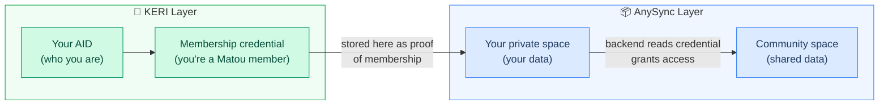
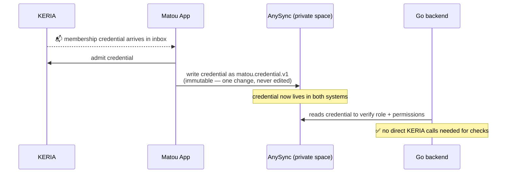
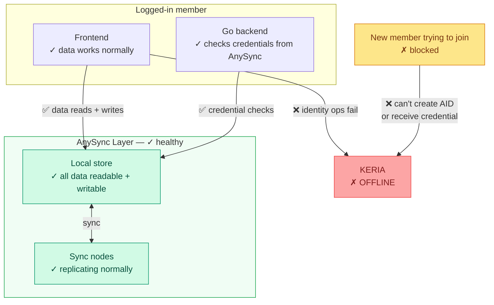
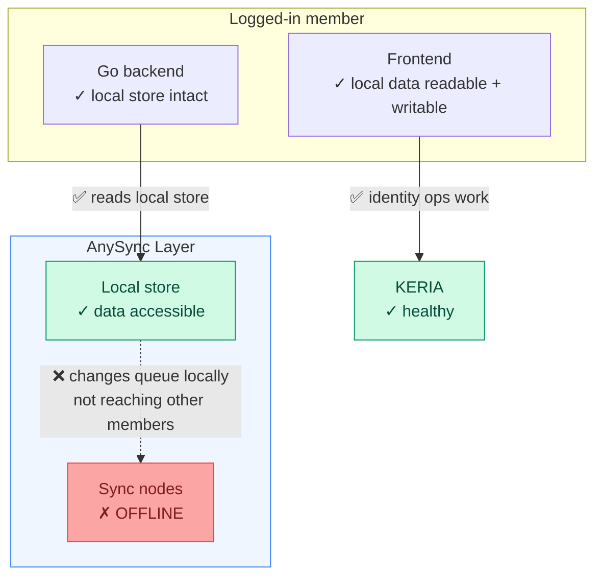

# KERI + AnySync — How They Work Together in Matou

This document explains how KERI and AnySync connect in Matou — what each layer is responsible for, where they hand off to each other, and what happens when one side has a problem. It assumes you've read the individual overviews: [keri-overview.md](./keri-overview.md) and [anysync.md](./anysync.md).

---

## Part 1 — Two Layers, One App

Matou is built on two separate infrastructure layers that each solve a different problem.

**KERI handles identity.** It answers: *who are you, and can I verify that?* It manages your cryptographic identifier, your key history, and your membership credential.

**AnySync handles data.** It answers: *what does the app contain, and how does it stay in sync across devices?* It manages everything you see and do — notices, profiles, RSVPs, files.

Neither system does the other's job. KERI doesn't know what a notice is. AnySync doesn't know what a key rotation is. They connect at one well-defined point: **your KERI credential is what authorises you to enter the AnySync spaces.**

---

## Part 2 — Where They Meet: The Credential Bridge

After you join Matou — whether through registration or an admin invite — the admin issues you a KERI membership credential via IPEX. Your app admits it from your KERIA inbox. At that point, the credential is immediately written into your **AnySync private space** as a `matou.credential.v1` object tree.

This is the bridge between the two systems. Your credential doesn't just live in KERIA's inbox — it lives in AnySync too, where the Go backend can read it to decide what you're allowed to do. The backend never calls KERIA directly on every request; it checks credentials from your local AnySync store.

This design has an important implication: **credential verification keeps working even if KERIA is temporarily offline**, because the backend reads from your local AnySync store, not from KERIA.

---

## Part 3 — Offline and Local-First

The honest picture of what "local-first" means in Matou, given the two-layer architecture.

**Your AnySync data is fully local.** Every notice, profile, RSVP, and file you've accessed is stored on your device. You can read and write all of that with no internet connection at all. When you reconnect, changes sync automatically in both directions.

**Identity operations need KERIA.** Anything involving your cryptographic identity — creating an account, applying for membership, rotating your keys, issuing or receiving a credential — requires a live connection to KERIA. These actions can't happen locally because they need to be anchored in your key event log and witnessed.

| What you're doing | Works offline? | Why |
|---|---|---|
| Read notices, profiles, files | ✅ Yes | Stored in local AnySync |
| Write notices, RSVPs, profile edits | ✅ Yes | Written to local DAG, synced later |
| View your credentials | ✅ Yes | Already in local AnySync |
| Log in for the first time | ❌ No | Needs KERIA to boot your agent |
| Register or accept an invite | ❌ No | Needs KERIA to create your AID |
| Receive a new credential | ❌ No | Needs KERIA inbox (IPEX admit) |
| Rotate your keys | ❌ No | Needs KERIA + witnesses |

**Once you're set up and logged in, the app is genuinely local-first** for day-to-day use. The moments that require KERIA are infrequent — joining, the occasional key rotation, receiving a new credential.

The KERI overview notes "app unusable" when KERIA goes down. That's specifically about attempting a fresh login when KERIA is offline. If you're already logged in and KERIA goes down mid-session, your AnySync data stays readable and writable locally — you just can't perform identity operations until KERIA is back.

---

## Part 4 — Cross-System Failure Scenarios

These scenarios focus on cases where one layer's failure affects the other. For failures that stay within a single system, see [keri-overview.md — Part 4](./keri-overview.md) and [anysync.md — Part 3](./anysync.md).

---

### KERIA goes down, AnySync is healthy

**What still works:** Reading all app content. Writing notices, RSVPs, profile changes. Verifying credentials already stored in AnySync. The day-to-day experience for any member who is already logged in.

**What breaks:** Fresh logins. New member registration and onboarding. Issuing or receiving credentials. Key rotation.

**Impact:** Existing sessions fully functional. Identity operations blocked. ⚠️

---

### AnySync sync nodes go down, KERIA is healthy

**What still works:** Everything in the local app. Identity operations still work. Issuing and receiving credentials still works. Your changes are written locally and will sync the moment nodes recover.

**What breaks:** Changes don't reach other members until sync nodes are back. New member credentials are issued fine but won't replicate to the backend until sync resumes — meaning they may not have full app access yet.

**Impact:** Local app fully functional. No remote sync until nodes recover. ⚠️

---

### New member trying to join when KERIA is down

Registration and onboarding both require KERIA at every step — creating the AID, sending the registration message, and admitting the credential. There is no fallback path.

The application itself doesn't fail loudly on the applicant's side — but the registration message won't reach admin inboxes until KERIA is back.

**Impact:** Registration and onboarding completely blocked until KERIA is restored. ❌

---

### New member trying to join when AnySync sync nodes are down

The KERI parts of joining still work — the AID gets created, the registration message is sent, the admin reviews it, and the credential is issued and admitted. The KERI side completes normally.

The issue comes at the last step: writing the credential into the new member's AnySync private space. The write happens locally on their device, but won't replicate to the backend until sync nodes recover — meaning the backend won't see their credential and they won't have full space access until sync resumes.

**Impact:** Registration completes but full app access may be delayed until AnySync sync is restored. ⚠️

---

### Both KERIA and AnySync sync nodes are down

This is the worst-case scenario, but less severe than it sounds.

**What still works:** Everything on your device that you've previously accessed. All your data is stored locally — AnySync was designed exactly for this. Your device is a full peer, not a thin client.

**What breaks:** Any operation involving the outside world — syncing changes to others, all identity operations, new member joins.

**Recovery:** Both systems recover independently and automatically. When KERIA comes back, identity operations resume. When sync nodes come back, your queued local changes are pushed automatically. No manual intervention needed.

**Impact:** Local app works. No external connectivity until both recover. ⚠️

---

## Summary

| Scenario | Identity ops | Local data | Sync with others |
|---|---|---|---|
| Everything healthy | ✅ | ✅ | ✅ |
| KERIA down | ❌ | ✅ | ✅ |
| Sync nodes down | ✅ | ✅ | ❌ |
| Both down | ❌ | ✅ | ❌ |
| Device offline | ❌ | ✅ | ❌ until reconnect |
| New member joining (KERIA down) | ❌ blocked | — | — |
| New member joining (sync nodes down) | ✅ completes | ✅ locally | ❌ delayed |

The key pattern: **your local data is always safe and accessible** — that's the AnySync guarantee and it holds regardless of what's happening to KERIA. What varies is your ability to sync with others and perform identity operations. Of the two layers, AnySync is the more resilient for day-to-day use because it's genuinely local-first. KERI is the more fragile layer for availability, which is why witness distribution and KERIA resilience matter — see [keri-distributed-deployment.md](./keri-distributed-deployment.md).
