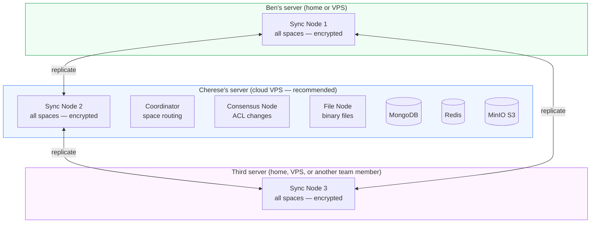
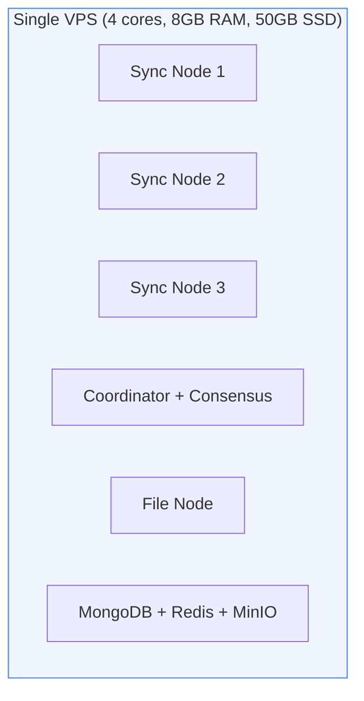
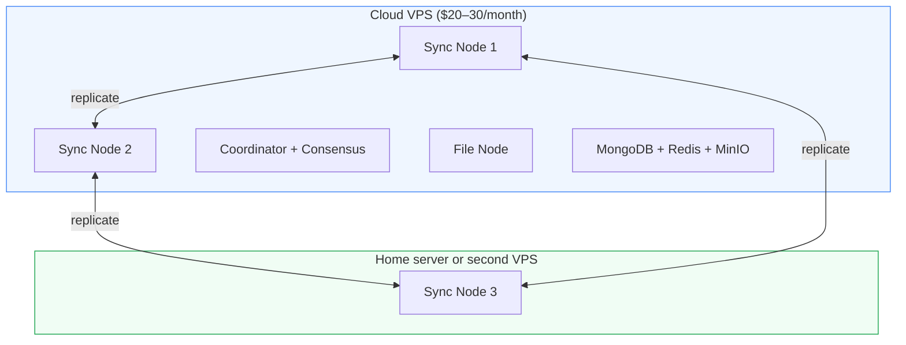
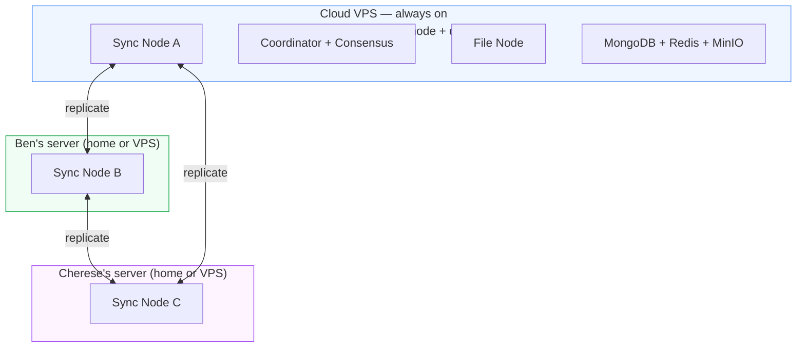

# AnySync Distributed Deployment

This document answers the practical questions for running Matou's AnySync infrastructure across multiple servers — Ben and Cherese's machines, cloud VPSes, or a mix. It assumes you've already read [anysync.md](./anysync.md) and won't repeat the protocol fundamentals covered there.

---

## Can Ben and Cherese host the AnySync deployment?

**Yes.** Sync nodes are stateless Docker containers — they hold only encrypted data and can run on any internet-accessible server. There's nothing that requires all three sync nodes to be on the same machine.

What you need per server is just:
- Docker 24+ with Compose v2
- Ports 1001–1006 (TCP) and 1011–1016 (UDP/QUIC) open inbound
- Enough disk for the replicated data (start with 50GB SSD)

The supporting services (coordinator, file node, consensus node, MongoDB, Redis, MinIO) are more stateful and are best co-located on one always-on server — ideally a cloud VPS, since those are more reliably online than a home connection.

**The practical split for Ben + Cherese:**



If Cherese's server hosts the coordinator and Ben's goes offline, **existing sync keeps working** on the other two nodes. If Cherese's server goes offline, existing sync continues between Ben's node and the third — but new member registrations and ACL changes are blocked until Cherese's server is back. That's the trade-off of co-locating the coordinator with one sync node.

To fully isolate coordinator downtime from sync availability, run the coordinator on its own separate server.

---

## How replication works (short version)

See [anysync.md](./anysync.md) for the full picture. The short version:

Every space is replicated across **all sync nodes** in the network. There's no primary/replica distinction — all nodes are equal peers. When a client writes a change, it goes to one node, which immediately replicates it to the others. Nodes compare DAG heads periodically (every 2 hours, and on startup) to catch anything that was missed.

The current Matou config sets:
```yaml
nodeSync:
  periodicSyncHours: 2
  syncOnStart: true
```

This means: on startup each node syncs with every other, then again every 2 hours. In practice, most replication happens in near-real-time as clients push changes — the periodic sync is a catch-up safety net.

---

## 3× replication guarantee

With three sync nodes, every space always has three complete copies. This is guaranteed by the protocol, not by configuration — it's how AnySync's consistent-hashing partition ring works. You don't need to do anything special to get 3× replication; running three sync nodes is sufficient.

**If one node goes down:** The other two still hold complete copies. The coordinator stops routing new clients to the downed node immediately. When the node comes back, it compares DAG heads with the others and auto-fetches only the missing blocks — no manual intervention required.

**If two nodes go down:** The one remaining node holds a full copy. Sync continues for anyone connected to it. When the other two come back, they catch up automatically.

**If all three nodes go down:** No remote sync is possible, but every user's device already holds a complete local copy of their own data. The app keeps working offline. Remote sync resumes automatically when any node comes back.

---

## How to verify a file has been replicated

### Check all nodes are reachable

```bash
# Uses the netcheck container
make -C any-sync health

# Expected output:
# ✓ any-sync-node-1:1001
# ✓ any-sync-node-2:1002
# ✓ any-sync-node-3:1003
# ✓ any-sync-coordinator:1004
# ✓ any-sync-filenode:1005
# ✓ any-sync-consensusnode:1006
# netcheck success
```

If all three sync nodes show green, your spaces are being replicated. AnySync doesn't currently expose a per-space "is this replicated on N nodes?" query, but reachability + the periodic sync guarantee covers it: if all three nodes are online and `periodicSyncHours` has elapsed since the last sync, all spaces are in sync.

### Check MinIO for file storage

Files are stored in MinIO (or S3) — there's only one file node in the current setup, so file replication is handled at the object-storage level rather than across sync nodes. To verify a file exists:

```bash
# Check via MinIO console (web UI)
http://localhost:9001  # dev
# or
http://your-server:9001  # prod

# Or via mc CLI
docker exec matou-anysync-create-bucket-1 mc ls minio/matou-bucket
```

For production resilience, MinIO itself should either be backed by RAID storage or replaced with a managed S3 service (AWS S3, Backblaze B2, Cloudflare R2) which has its own replication.

---

## Does the coordinator need to always be online?

**No — but it matters what's offline.**

The coordinator is only involved in:
- Routing a new client to its sync node (first connection)
- Creating a new space
- Membership changes (adding/removing members to a space)

It is **not** involved in:
- Ongoing sync between connected clients and sync nodes
- Node-to-node replication
- Reading or writing data

So if the coordinator goes offline:
- All users who have already connected keep syncing normally ✅
- New registrations cannot be processed ❌
- New spaces cannot be created ❌
- Membership changes fail ❌

**Can it run as a distributed/HA node?**

Not in the same way sync nodes are distributed. The coordinator is a single stateful service backed by MongoDB. It can be made more available by:

1. **Using a managed MongoDB** (MongoDB Atlas or similar) instead of the local container — this separates the coordinator process from the database so you can restart the coordinator without losing state.
2. **Running two coordinator processes** pointing at the same MongoDB — AnySync supports multiple coordinator instances. If one dies, clients retry and hit the other.
3. **Using a MongoDB replica set** (already configured in the Docker setup) — MongoDB's own HA handles database availability.

The consensus node (ACL changes) has the same profile as the coordinator — stateful, MongoDB-backed, not critical for ongoing sync.

---

## Adding a new sync node to extend storage

Adding a new sync node means regenerating the network config with the new node included. **This cannot be done hot** — config generation is a one-time operation that bakes in the network topology with cryptographic keys for each node.

### Steps

1. **Stop all services**
   ```bash
   make -C any-sync down
   ```

2. **Update the config to include the new node's address**

   Edit `any-sync/config.env` and add the new node's addresses:
   ```bash
   # New node addresses
   ANY_SYNC_NODE_4_HOST=new-server.example.com
   ANY_SYNC_NODE_4_PORT=1001
   ANY_SYNC_NODE_4_ADDRESSES=new-server.example.com:1001
   ANY_SYNC_NODE_4_QUIC_PORT=1011
   ANY_SYNC_NODE_4_QUIC_ADDRESSES=new-server.example.com:1011
   ```

3. **Regenerate the network config**

   > ⚠️ WARNING: Regenerating the network config changes the `nodes.yml` that clients use. All connected clients will need to fetch the new config. Do NOT regenerate if you want to preserve existing client connections seamlessly — instead, add the node to the existing network via the coordinator's confapply tool if possible.

   ```bash
   make -C any-sync generate-config
   ```

   This calls `anyconf generate-nodes` with the new node included, creating `account3.yml` (or the next available number) for the new node's keys.

4. **Distribute the new node's config to the new server**

   Copy the generated `etc/any-sync-node-4/config.yml` to the new server, along with the network identity files.

5. **Start services**
   ```bash
   # On existing servers
   make -C any-sync up

   # On the new server
   docker compose up any-sync-node-4
   ```

6. **Verify replication catches up**
   ```bash
   make -C any-sync health
   # Wait for the next periodicSync cycle (or restart the new node to trigger syncOnStart)
   ```

### Does running multiple sync nodes on the same server help?

For **storage**: Yes, in principle — each node has its own storage directory, so you're spreading data across multiple disk paths. But this only helps if those paths are on different physical disks.

For **resilience**: **No.** If the server goes down, all nodes on it go down together. Three sync nodes on the same machine is the same risk profile as one sync node. Multiple nodes on the same server make sense for testing or load distribution, but not for fault tolerance.

---

## Recommended minimum deployments

### Option 1 — Getting started (single server)

Everything on one server. Functional but no fault tolerance.



**Use when:** Prototyping, development, or a small community that can tolerate occasional downtime.

**What you don't get:** If the server reboots or has an outage, all sync stops. Data isn't lost (it's still on users' devices), but nobody can sync until the server is back.

**Cost estimate:** ~$20–40/month for a basic VPS (Hetzner, DigitalOcean, etc.).

---

### Option 2 — Minimal resilience (2 servers)

One always-on cloud VPS + one home server or second VPS. The cloud VPS hosts the coordinator and stateful services.



**What you get:** If the home server goes down, two sync nodes on the cloud VPS keep running. If the cloud VPS goes down, the home sync node keeps data safe locally until the VPS is back.

**What you don't get:** If the cloud VPS (which hosts the coordinator and both SN1+SN2) goes down, you lose two of your three sync nodes simultaneously. This is the weakest version of "3× replication" — two copies on one machine aren't truly independent.

---

### Option 3 — Secure 3× replication (3 independent servers)

Each sync node on a different physical machine in a different location. This is the recommended target.



**What you get:**
- Genuine 3× replication — each copy is on independent hardware in an independent location
- If any one server goes down (including the cloud VPS), sync continues on the other two
- If the cloud VPS goes down, existing sync keeps working; only new registrations and ACL changes are blocked
- ~$40/month cloud VPS + two home servers with existing internet connections

**Upgrade path:** Run a second coordinator instance on Ben's or Cherese's server, pointing at the same MongoDB (via external URI), to eliminate the coordinator as a single point of failure for new registrations.

---

## Summary

| Question | Answer |
|---|---|
| Can Ben and Cherese host it? | Yes — sync nodes are just Docker containers on any internet-connected server |
| Does it auto-recover when a node comes back? | Yes — head-based DAG sync catches up automatically, no manual steps |
| 3 nodes on same server = 3× resilience? | No — same physical machine is a single point of failure |
| Coordinator always needs to be online? | No — only for new spaces, new registrations, ACL changes. Ongoing sync is unaffected. |
| Can coordinator be distributed? | Partially — run two instances + managed MongoDB for HA |
| How to add a sync node? | Regenerate network config with new node's address, then deploy |
| How to verify replication? | `make health` confirms all nodes reachable; AnySync handles replication automatically |
| Minimum to get started? | 1 server with all services (~$20–40/month) |
| Minimum for secure 3× replication? | 3 independent servers — Ben + Cherese + cloud VPS is the right shape |