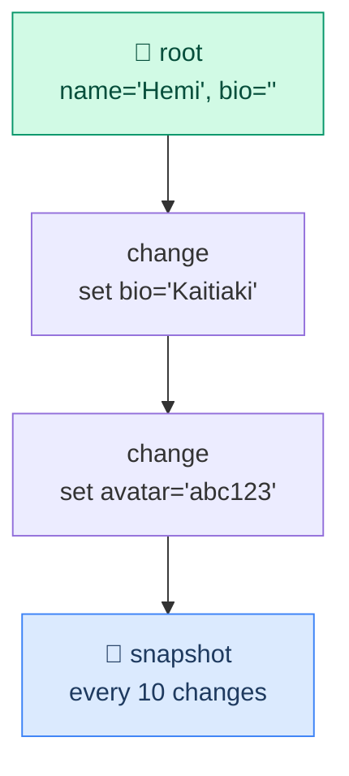
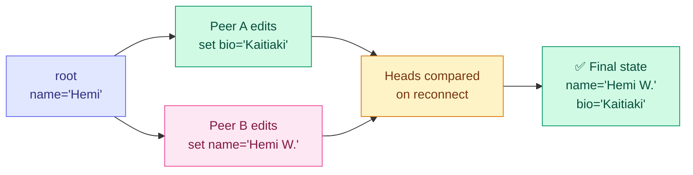
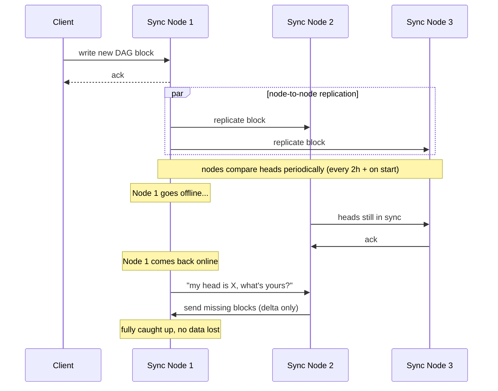
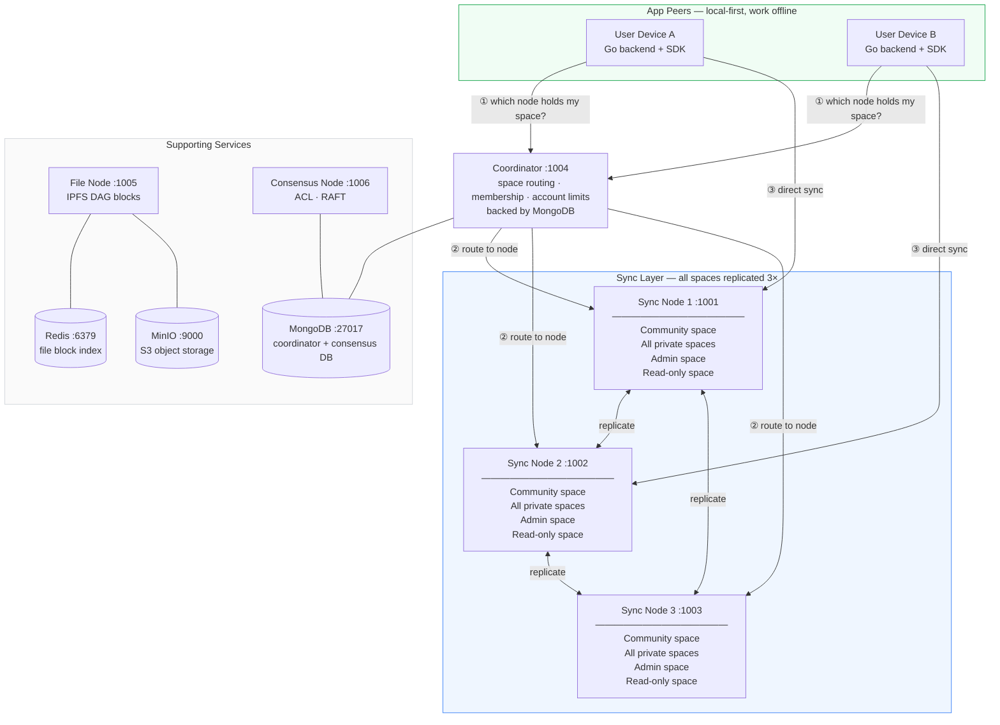
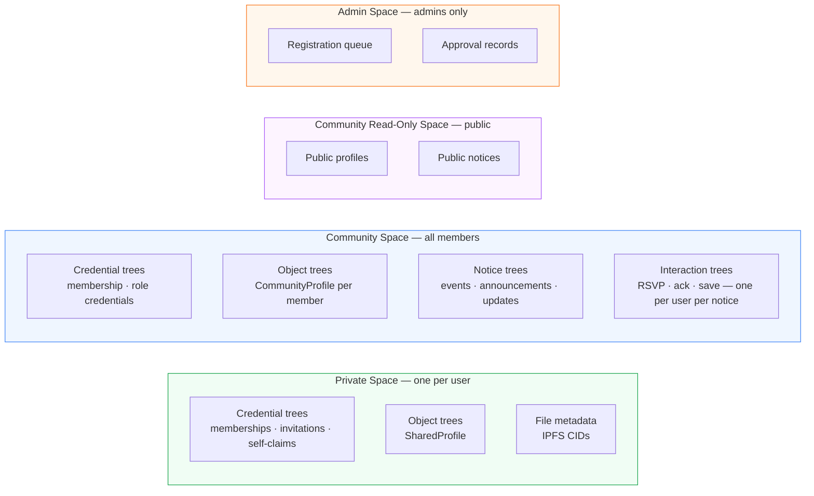
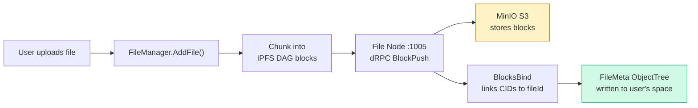
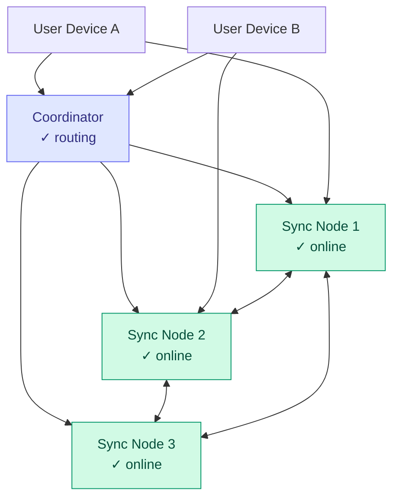
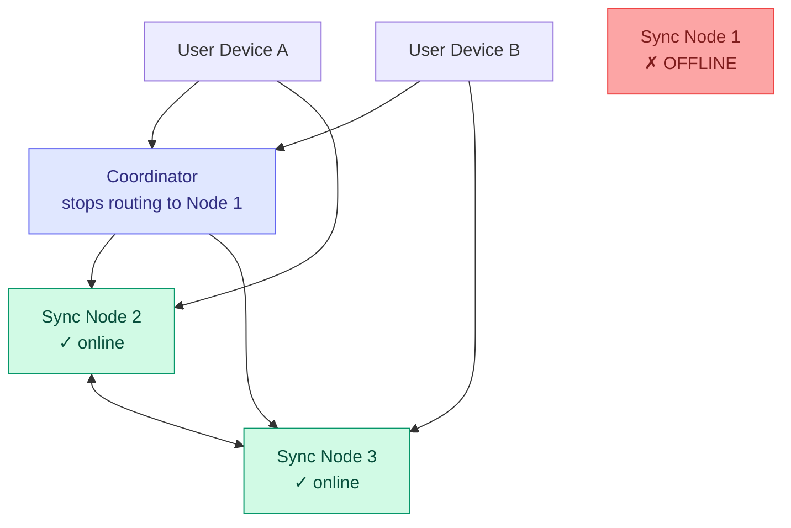
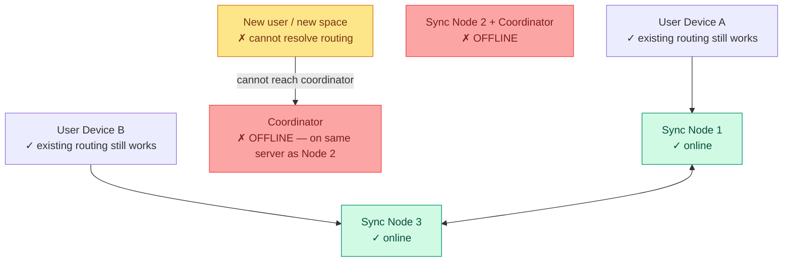
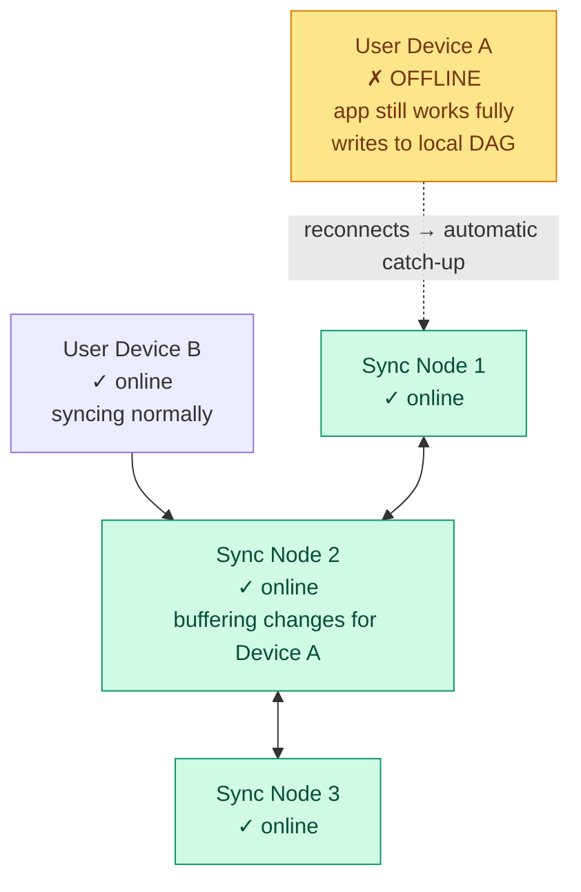

# AnySync — How It Works and How Matou Uses It

This document explains the AnySync protocol from first principles, then shows how Matou's infrastructure uses it. It covers the node types, the space model, how data replicates, and what happens when things go wrong.

---

## Part 1 — AnySync Concepts

### What is AnySync?

AnySync is an open-source protocol for building **local-first, peer-to-peer, end-to-end encrypted** applications. It was built by the Anytype team and powers the Anytype app.

The core idea is **local-first**: every user's data lives on their own device first. Servers exist purely to relay changes between devices — they can't read the content because everything is end-to-end encrypted.

---

### The Five Node Types

#### 1. Application peer (user node)

This is the **client app** — a user's phone, laptop, or the backend process running on their behalf. It holds a full local copy of all data the user has access to. The app works completely offline. When connectivity returns, it syncs in the background.

In Matou, the **Go backend** running per-user is the application peer. It connects to the sync nodes on behalf of the user and keeps the local anystore database in sync.

#### 2. Sync node (`any-sync-node`)

An always-online server that **stores and replicates spaces**. Multiple sync nodes share the load via a consistent hashing partition ring — each space is assigned to a set of responsible nodes. Sync nodes communicate directly with each other to stay in sync. They solve the "closed laptop problem": if your device is offline when a collaborator makes a change, the sync node buffers that change and delivers it when you reconnect.

Data stored on sync nodes is **encrypted** — the nodes hold ciphertext they cannot read.

#### 3. File node (`any-sync-filenode`)

Handles **binary file storage** separately from object/space data. Files are chunked into IPFS DAG blocks and pushed to an S3-compatible backend (MinIO or AWS S3). The file node uses Redis with a Bloom filter for fast block lookup.

#### 4. Coordinator node (`any-sync-coordinator`)

The **network's phonebook**. It maps spaces to their responsible sync nodes, manages space creation, handles membership, and enforces per-account storage limits. Clients query the coordinator once to find which sync node holds their space, then connect directly to that node for all future syncing. The coordinator is **not** in the critical path for ongoing sync — only for routing and administrative changes. Requires MongoDB.

#### 5. Consensus node (`any-sync-consensusnode`)

Handles **ACL (access control list) changes** using the RAFT consensus protocol. When a member is added to or removed from a space, that change needs to be agreed upon consistently across all nodes — the consensus node ensures this happens without conflicts. Also requires MongoDB.

---

### Spaces

A **space** is an isolated, end-to-end encrypted container. Think of it as a shared encrypted folder — it has a set of members (defined by its ACL), and it holds a collection of object trees.

Every space has:
- A unique space ID
- An access control list (who can read/write)
- A set of object trees (the actual data)
- A set of responsible sync nodes (assigned by the coordinator via consistent hashing)

Each space is replicated across **all sync nodes** in the network, so if any one node goes down the space remains available.

---

### Object Trees and DAGs

Inside each space, every individual object (a profile, a credential, a chat message, a notice) gets its own **object tree** — a Directed Acyclic Graph (DAG) of encrypted changes.

Think of it like a git commit history for a single object. Each block in the DAG is cryptographically signed and hashed. State is reconstructed by replaying the chain of changes from the root (or from the most recent snapshot). Snapshots are taken automatically every 10 changes for performance.



Changes are stored as **field-level operations**:

```json
{
  "ops": [
    {
      "op": "set",
      "field": "displayName",
      "value": "Hemi"
    },
    {
      "op": "unset",
      "field": "bio"
    }
  ]
}
```

This is more efficient than storing full document replacements, and it enables CRDT merge (see below).

---

### CRDT — Handling Concurrent Edits

AnySync uses **CRDTs (Conflict-free Replicated Data Types)** to handle the case where two peers edit the same object while offline from each other.

When two peers reconnect:
1. They exchange their latest **DAG heads** (the tip hashes of their chains)
2. If heads differ, they identify exactly where the chains diverged
3. They transfer only the **missing blocks** — not the whole object
4. Each node applies the incoming blocks to its DAG — changes merge automatically



The merge rules are:
- **Different fields edited** → both changes survive, final state has both
- **Same field edited by both** → the change with the later timestamp wins; the other is preserved in the DAG history
- **RSVP / interactions** → Matou avoids conflicts entirely by giving each user their own tree (`RSVP-{noticeId}-{userId}`)

---

### How Replication Works Between Sync Nodes



---

## Part 2 — Matou's Infrastructure

### Architecture Overview



App peers connect to the coordinator **once** to discover their assigned sync nodes, then sync directly with those nodes. The coordinator is not involved in every operation — only in routing, space creation, and membership changes.

---

### The Four Space Types in Matou

Matou runs four distinct spaces, each with different access rules:

| Space | Type | Who can write | Who can read |
|---|---|---|---|
| Private space | `private` | Owner only | Owner only |
| Community space | `community` | Admin only | All members |
| Community read-only | `community-readonly` | Admin only | Public / unauthenticated |
| Admin space | `admin` | Admins only | Admins only |

Each user gets their own private space. The community, read-only, and admin spaces are shared across the org and configured at startup.



#### Object tree types

| Change type | Used for | Mutable? |
|---|---|---|
| `matou.credential.v1` | KERI credentials (memberships, roles) | No — single init change |
| `matou.object.v1` | Profiles, chat channels, messages, type definitions | Yes — incremental field ops |
| `matou.notice.v1` | Events, updates, announcements | Yes — admin can update |
| `matou.interaction.v1` | RSVPs, acks, saves | Yes — user can change their RSVP |

Credentials are **immutable** — once issued, the tree has exactly one change (the initial snapshot). This preserves the integrity of the KERI credential.

---

### File Storage Path



---

### Dev vs Test Network

| Network | Sync nodes | Coordinator | File node | Consensus |
|---|---|---|---|---|
| Dev | :1001–1003 | :1004 | :1005 | :1006 |
| Test | :2001–2003 | :2004 | :2005 | :2006 |

```bash
make up          # start dev network
make up-test     # start test network (isolated, ports +1000)
make health      # check all nodes are reachable
```

---

## Part 3 — Failure Scenarios

### Normal operation

All three sync nodes are online. Every space is replicated 3×. Clients connect to their assigned node via coordinator routing.



---

### Sync Node 1 (or 3) goes offline



**What happens:**
- Coordinator stops routing new connections to node 1 immediately
- All app peers reconnect to nodes 2 and 3 transparently
- All spaces remain fully available — full copies exist on the other two nodes
- When node 1 comes back, it catches up by comparing DAG heads and requesting only the missing blocks

**Impact:** None to users. ✅

---

### Sync Node 2 goes offline — coordinator risk

Node 2 is the recommended host for the coordinator and consensus node (the always-on cloud VPS). If it goes down, the coordinator goes with it.



**What happens:**
- Existing sync between nodes 1 and 3 continues unaffected
- App peers with existing routing continue syncing normally
- New member registrations and ACL changes fail until coordinator is back
- New connections from unknown clients cannot resolve routing

**Impact:** Ongoing sync works. New operations are blocked. ⚠️

**Mitigation:** Run a second coordinator instance on a different server.

---

### All three sync nodes offline

- App peers that are online cannot push changes — writes queue locally
- App peers that are offline are unaffected — local app keeps working
- Data is not lost: every device holds a full local copy of everything they've accessed
- Recovery is fully automatic when nodes come back

**Impact:** No remote sync. Local apps still work. ⚠️

---

### App peer (client device) goes offline



**What happens:**
- The app on Device A keeps working — all data is stored locally
- Any changes the user makes are written to their local DAG
- Changes from other users are buffered on the sync nodes
- On reconnect, the backend syncs bidirectionally — pushes local changes, pulls buffered changes
- CRDT merge handles any concurrent edits automatically

There is no difference from the user's perspective between being offline for an hour or a week — reconnecting triggers the same automatic catch-up.

**Impact:** None to the offline user's local experience. ✅

---

### Summary

| Scenario | Data safe? | Sync continues? | Blocked operations |
|---|---|---|---|
| Node 1 or 3 down | ✅ Yes | ✅ Yes (on 2 nodes) | None |
| Node 2 (cloud) down | ✅ Yes | ✅ Yes (on 2 nodes) | New spaces, ACL changes, new clients |
| All nodes down | ✅ Yes (local) | ❌ No remote sync | All remote sync |
| Client offline | ✅ Yes (local) | ✅ Local only | Remote sync until reconnect |
| Client offline + node down | ✅ Yes (local) | ❌ No | Remote sync until both recover |
