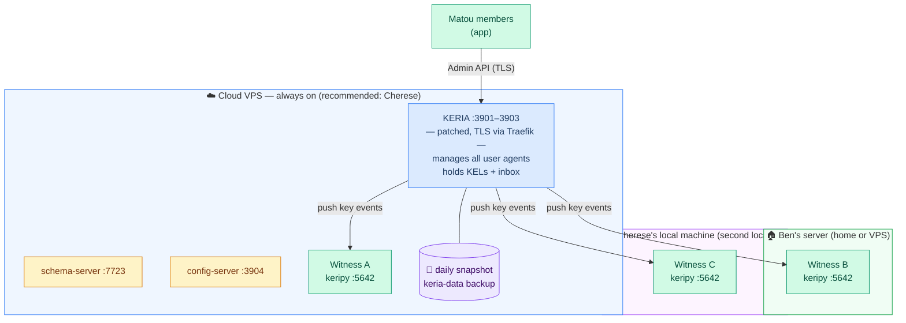
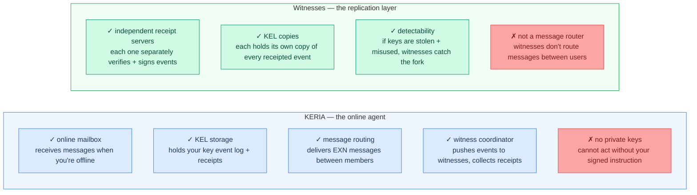
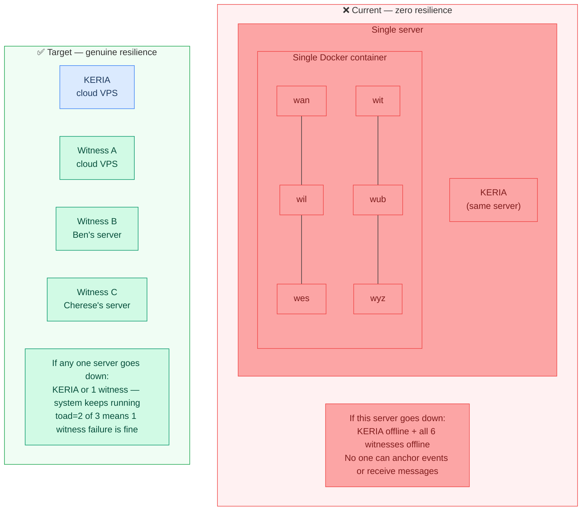
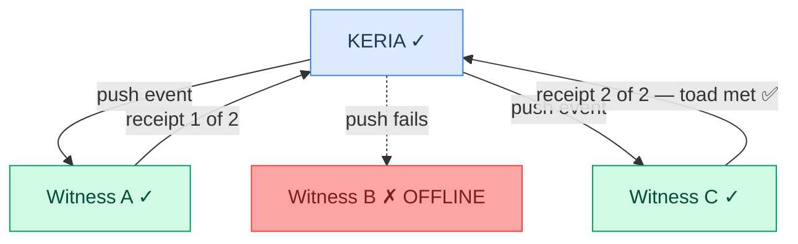
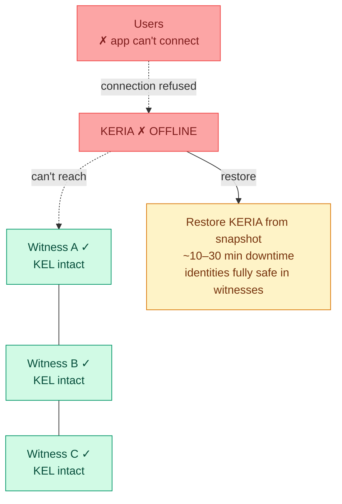
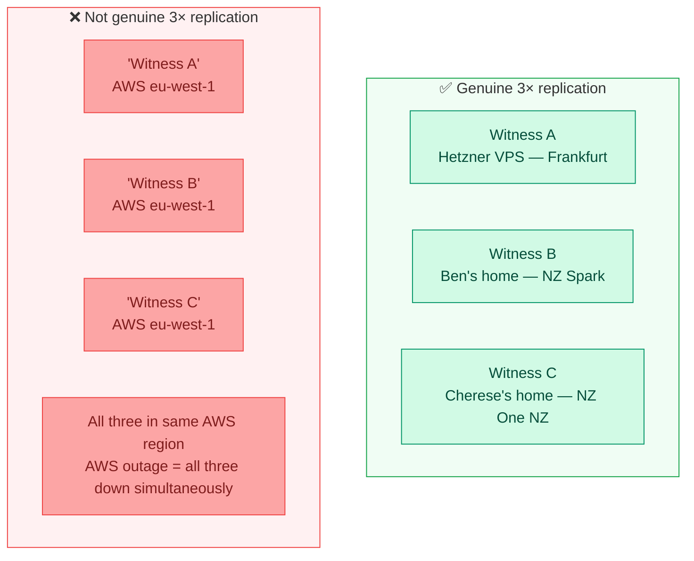
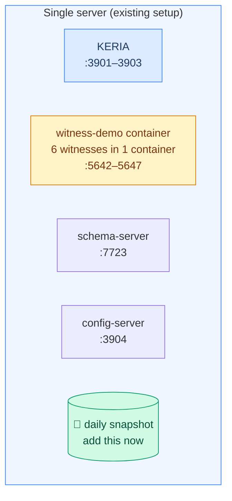
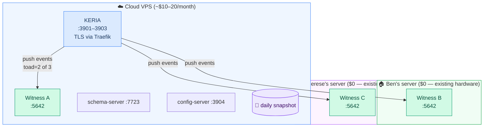
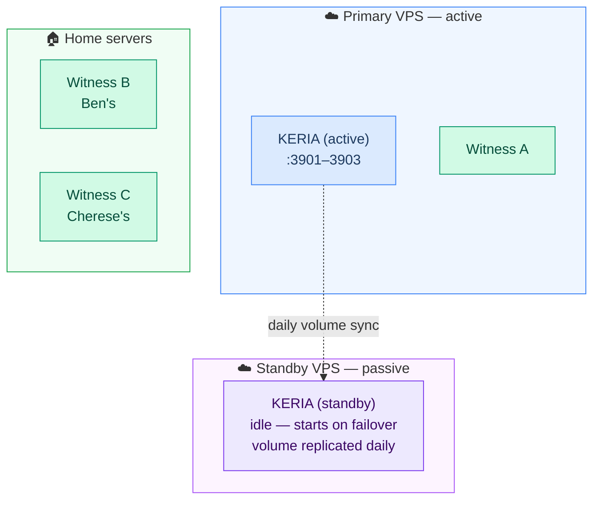
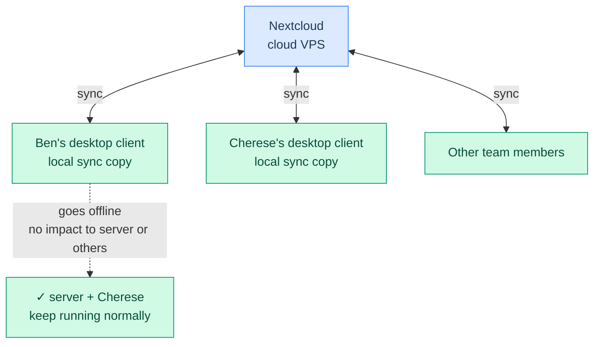

# KERI Distributed Deployment

This document answers the practical questions for running Matou's KERI infrastructure across multiple servers — Ben and Cherese's machines, cloud VPSes, or a mix. It assumes you've already read [keri-overview.md](./keri-overview.md) and won't repeat the protocol fundamentals covered there.

---

## Can Ben and Cherese host the Matou KERI deployment?

**Yes.** KERIA is a Python web service in Docker. Witnesses are also Python services in Docker. Both are designed to be self-hosted — the WebOfTrust team publish official Docker images for both and that's exactly how production deployments are expected to work.

What you need per server:
- Docker 24+ with Compose v2
- Stable public domain name (OOBIs are URLs — if the domain changes, existing OOBIs break for all users)
- Open ports: 3901–3903 for KERIA, 5642+ per witness
- TLS termination (Traefik is already configured in `docker-compose.prod.yml` with Let's Encrypt)

The practical split for Ben + Cherese:



KERIA stays on the cloud VPS because it needs to be always-on (it's the user's online mailbox and message router). Witnesses are lightweight and can run anywhere with a public IP — a home connection with a stable domain name or DDNS works fine.

---

## Understanding agents and witnesses — what they each do

Before planning deployment it's important to be clear about what KERIA and witnesses actually are, because they have completely different roles and different resilience implications.



**The crucial difference from AnySync:** In AnySync, sync nodes replicate data _to each other_ in the background. In KERI, witnesses receive events _pushed from the controller_ at the time of signing — there is no background gossip between witnesses. Replication happens when a key event is created, not continuously.

**Your instinct was right:** KERIA is the online mailbox/inbox. It manages agents (one per user), holds KELs, and routes messages. Signing happens locally in the app via signify-ts — credentials are signed on your device and delivered to KERIA, not the other way around.

---

## How to add a device to extend resilience

"Adding a device" means deploying a new **witness** on that device. KERIA itself does not replicate across instances — resilience for the identity layer comes entirely from distributing witnesses.

### Adding a new witness

Each witness is a separate `keripy` process. Steps:

**1. Deploy the witness on the new server:**
```bash
# On the new server — create witness config
mkdir -p /opt/matou-witness/config
cat > /opt/matou-witness/config/witness.json << 'EOF'
{
    "dt": "2026-01-01T00:00:00.000000+00:00",
    "wan": {
        "dt": "2026-01-01T00:00:00.000000+00:00",
        "curls": ["http://your-server.example.com:5642/"]
    },
    "iurls": []
}
EOF

# Run the witness
docker run -d \
  --name matou-witness \
  -p 5642:5642 \
  -v /opt/matou-witness/config:/keripy/scripts/keri/cf/main \
  -v /opt/matou-witness/data:/usr/local/var/keri \
  weboftrust/keri:latest \
  witness start --name wan --loglevel INFO
```

**2. Update `keria-config.json` with the new witness OOBI:**
```json
{
    "iurls": [
        "http://cloud-witness.example.com:5642/oobi/<witnessAID>/controller",
        "http://ben-witness.example.com:5642/oobi/<witnessAID>/controller",
        "http://cherese-witness.example.com:5642/oobi/<witnessAID>/controller"
    ]
}
```

**3. Update AID creation in `frontend/src/lib/keri/client.ts`** to use the new witnesses and a higher toad:
```typescript
// Currently (dev — only 1 witness):
result = await this.client.identifiers().create(name, {
    wits: ['BBilc4-L3tFUnfM_wJr4S4OJanAv_VmF_dJNN6vkf2Ha'],
    toad: 1,
});

// Production (3 witnesses, toad=2):
result = await this.client.identifiers().create(name, {
    wits: [WITNESS_A_AID, WITNESS_B_AID, WITNESS_C_AID],
    toad: 2,  // need 2 of 3 receipts — tolerates 1 witness failure
});
```

**4. Restart KERIA** so it re-resolves the updated witness OOBIs.

> ⚠️ **Existing AIDs are not automatically migrated.** AIDs created with the old single-witness setup keep their `wits: [wan]` and `toad: 1`. New AIDs will use the updated config. To migrate existing AIDs, each user would need to rotate their keys with the new witness list — this can be done gradually.

---

## How do we know whether all agents have been successfully replicated?

In KERI "replication" means witnesses have receipted the key event. Here's how to check at each level:

### At event creation time (automatic)

The signify-ts `operations().wait()` call blocks until KERIA has confirmed that `toad` witnesses have receipted the event:

```typescript
const op = await result.op();
await client.operations().wait(op, { signal: AbortSignal.timeout(180000) });
// If this resolves without error → toad witnesses have receipted ✓
// If this times out → fewer than toad witnesses responded
```

If `wait()` times out (currently 3 minutes for witness-backed AIDs), the event either wasn't receipted by enough witnesses or KERIA couldn't reach them. Check witness health.

### Manually verifying a witness has the KEL

Query each witness's OOBI endpoint directly:
```bash
# Replace with actual witness AID and AID to check
curl http://witness-a.example.com:5642/oobi/<aidToCheck>

# A successful response includes the key state (sequence number, current keys)
# All witnesses should return the same sequence number for a fully-replicated AID
```

If all witnesses return the same `s` (sequence number), the KEL is fully replicated.

### Health check for witnesses

```bash
# Check each witness OOBI endpoint is responding
curl -f http://witness-a.example.com:5642/oobi  # HTTP 405 = healthy
curl -f http://witness-b.example.com:5642/oobi
curl -f http://witness-c.example.com:5642/oobi

# Or use the existing health check script (update with real witness URLs):
./scripts/health-check.sh
```

---

## Can we be confident there's enough resilience to go fully distributed?

**Not with the current setup.** The `witness-demo` image was not designed for production — it bundles all 6 witnesses into a single container for use in automated tests. Here's what the current and target states look like:



### If one server goes down — what happens?

**One witness goes down (toad=2 of 3):**



Users see no impact. When Witness B comes back, KERIA pushes any missed events and it catches up.

**KERIA goes down (witnesses still up):**



Users can't use the app until KERIA is restored. Their identities are completely safe in witnesses. If KERIA's database is fully lost (not just restarted), users can re-initialize with their mnemonic and KERIA re-builds from the witnesses — only message history and notifications would be gone.

**Does it pull a file from somewhere else if a server goes down?**

For witnesses: yes, effectively — if you had `toad=2` and one witness goes down, the other two still hold the complete KEL and any verifier can get the key state from them. No manual action needed.

For KERIA: no automatic failover. KERIA has a single database and doesn't cluster natively. Recovery requires restoring from a snapshot (manual, ~10–30 minutes).

---

## Does running multiple sync-nodes on the same server help?

For KERI witnesses: **No.** Three witnesses on the same server have the same failure profile as one witness. If the server goes down, all three go with it. Geographic separation is what gives resilience, not process count.

For KERIA: running two KERIA instances on the same server would cause conflicts (both trying to write the same database). It doesn't make sense.

The only scenario where multiple witnesses on one server is useful is for testing or for load-testing during development — not for production resilience.

---

## Minimum 3× replication across a mix of cloud and distributed servers

3× replication in KERI means **3 witnesses that have independently receipted every key event**. For this to be meaningful, those 3 witnesses must be on genuinely independent infrastructure.

**What "independent" means:**
- Different physical machines (obviously)
- Different network providers (so one ISP outage doesn't kill multiple witnesses)
- Ideally different geographic regions



**Cloud servers have built-in backup and deploy — does that change the calculation?**

Cloud providers offer automatic snapshots, health checks, and fast re-deploys. This helps **KERIA** significantly — a crashed KERIA instance can be restarted in minutes from a snapshot, and managed volumes survive server failures. This is why KERIA is best hosted on a cloud VPS.

For **witnesses**, cloud HA is less helpful. Witnesses are stateless and lightweight — they recover fast anyway. The real risk is a cloud provider outage or account issue taking down multiple witnesses if they're all on the same provider. Mix at least one home server into the witness set.

**Recommended mix for Ben + Cherese:**

| Service | Where | Why |
|---|---|---|
| KERIA | Cloud VPS (Hetzner, DO) | Needs stable uptime + daily snapshots + TLS |
| Witness A | Same cloud VPS (or second small VPS) | Always online, fast |
| Witness B | Ben's home server | Different network, different ISP |
| Witness C | Cherese's home server | Different network, different location |

---

## Recommended minimum deployments

### Option 1 — Getting started (current + hardening, ~$15/month)

Keep the existing `witness-demo` container for now. Add daily snapshots for `keria-data`. This buys you recovery from accidental deletion but not from server failure.



**What you get:** Recovery from data loss in ~30 minutes. Server failure still takes everything down.

**Cost:** ~$0 additional if you already have a server. Add cloud provider snapshot billing (~$1–2/month).

**Use when:** You're not yet ready to set up distributed witnesses and can tolerate downtime.

---

### Option 2 — Recommended (1 KERIA + 3 witnesses, ~$30–50/month)

Replace `witness-demo` with 3 independent witness processes across 3 separate machines. Set `toad=2`. This is the minimum for genuine resilience.



**What you get:**
- Any 1 witness can go offline — members keep anchoring events, no impact
- KERIA failure: ~10–30 min RTO from snapshot, identities safe in witnesses
- Ben or Cherese's home server going down: no impact to other users

**What you don't get:** Zero-downtime KERIA failover (KERIA is still a single point for app connectivity).

**Cost:** ~$10–20/month for cloud VPS + $0 for home servers.

---

### Option 3 — Robust (+ cold standby KERIA, ~$60–100/month)

Add a second cloud server as a KERIA cold standby. Kept in sync via daily volume replication. On failure, promote standby in ~5 minutes.



**What you get:** KERIA RTO drops to ~5 minutes. Three genuinely independent witnesses. Byzantine fault tolerance (2 of 3 must be compromised simultaneously to forge an identity).

**Cost:** ~$30–50/month for two VPS + home servers.

---

## Setting up Matou Nextcloud

### Can Ben and Cherese host Matou Nextcloud?

**Yes.** Nextcloud is fully self-hosted, Docker-deployable, and well-documented. It's the right tool for shared file storage, document collaboration, and calendar/contact sync.

### Deployment plan

**Cloud server (always-on):**
```yaml
services:
  nextcloud:
    image: nextcloud:latest
    ports: ["80:80"]
    volumes:
      - nextcloud-data:/var/www/html
      - nextcloud-files:/var/www/html/data
    environment:
      NEXTCLOUD_ADMIN_USER: admin
      MYSQL_HOST: db
      MYSQL_DATABASE: nextcloud
      MYSQL_USER: nextcloud
      MYSQL_PASSWORD: ...
  db:
    image: mariadb:10.6
    volumes:
      - db-data:/var/lib/mysql
```

**Local replica — Ben's machine:** Install Nextcloud Desktop Client → configure to sync from cloud server. Files available locally even when server is offline.

**Local replica — Cherese's machine:** Same. Second independent local copy.

**Test: does cloud stay live if one device goes offline?** Yes — by design. Nextcloud clients are independent of server availability. A client going offline doesn't affect other clients or the server. The server only goes offline if the cloud VPS goes down.



**Deploying a second local backup:** Run Nextcloud on a Raspberry Pi or spare machine at a second location, configured as an additional sync client. It holds a third copy of all files with no extra cloud cost.

**Better alternative?** Nextcloud is the right choice for self-hosted file sync. If you only need file sync (not calendars/contacts/collaboration), **Syncthing** is simpler — pure peer-to-peer, no server required, but then you need one always-on device acting as a hub. Nextcloud is more featureful and better supported.

---

## Summary

| Question | Answer |
|---|---|
| Can Ben and Cherese host it? | Yes — KERIA and witnesses are Docker services on any internet-accessible server |
| What does KERIA do? | Online mailbox, KEL storage, message routing — never holds private keys |
| What do witnesses do? | The replication layer — independently receipt and store key events |
| How to add a device? | Deploy a keripy witness process, update `keria-config.json` iurls, raise toad in client.ts |
| How do we know agents are replicated? | `operations().wait()` confirms toad receipts; query `/oobi/<aid>` on each witness to verify manually |
| Is current setup resilient? | No — witness-demo is a dev tool; all 6 witnesses in one container on one server |
| Does multiple witnesses on same server help? | No — geographic/network separation is what gives resilience |
| If one server goes down, does it pull from elsewhere? | Witnesses: yes (toad=2 of 3 means 1 failure is fine). KERIA: no auto-failover, manual restore needed |
| Cloud vs mix for witnesses? | Mix is better — cloud VPS for KERIA, home servers for witnesses gives real independence |
| Minimum to get started? | Current setup + daily snapshot (~$15/month) |
| Minimum for genuine 3× resilience? | 1 cloud VPS (KERIA + Witness A) + Ben's server (Witness B) + Cherese's server (Witness C), toad=2 (~$30–50/month) |
