# KERI & KERIA — Matou Deep Dive

## Part 1 — KERI Concepts

### What is KERI?

**KERI** (Key Event Receipt Infrastructure) is a decentralised identity protocol invented by Samuel Smith in 2019. Its core idea: a controller (person, organisation, device) can prove who they are using cryptographic keys that _they_ control — without any shared blockchain, registry, or identity provider.

A KERI identity is called an **AID** (Autonomic Identifier). Every AID has a **KEL** (Key Event Log) — an append-only, cryptographically chained log of key events. The KEL is the ground truth for an AID's key state. It is signed by the controller and receipted by witnesses.

---

### The Seven Hard Problems KERI Solves

| Problem | What it means | KERI solution |
|---|---|---|
| **Rotation** | Change signing keys without breaking past signatures | Pre-rotation: next keys are committed in advance |
| **Recovery** | Recover from key loss without reissuing everything | Pre-rotation keys act as recovery path |
| **Detectability** | Know if your keys were stolen and used | Witnesses + Watchers — the "oil light" |
| **Discovery** | Find the current key state of any AID | OOBIs (Out-of-Band Introductions) |
| **Delegability** | Let a sub-entity sign on your behalf | Delegated AIDs |
| **Revocability** | Revoke credentials without central authority | Anchored issuances in KEL |
| **Multi-signature** | Weighted m-of-n threshold signing | Group AIDs |

---

### The Protocol Actors

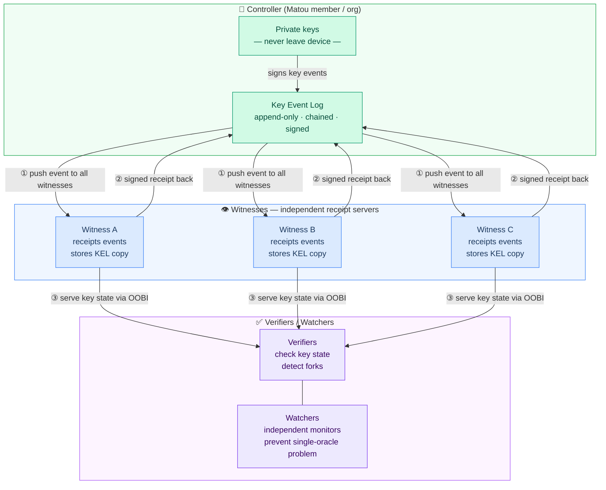

**Key insight**: to compromise a KERI identifier, every one of its witnesses must also be compromised simultaneously. The witnesses don't need to trust each other — they independently verify and receipt events.

---

### Pre-Rotation

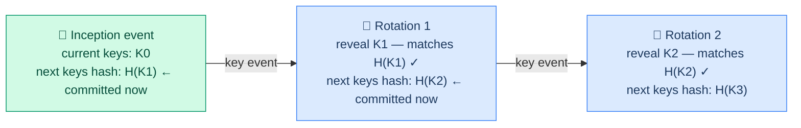

At inception, you commit to the _hash_ of your next keys. An attacker who steals your current signing key **cannot rotate your identity** because they don't have the pre-rotation keys. Pre-rotation is KERI's greatest innovation and is what makes witness-backed detectability meaningful.

---

### OOBIs — How Parties Discover Each Other

An **OOBI** (Out-of-Band Introduction) is a URL that lets one party discover another's key state:

```
http://<keria-host>:3902/oobi/<AID>/agent/<agentAID>
```

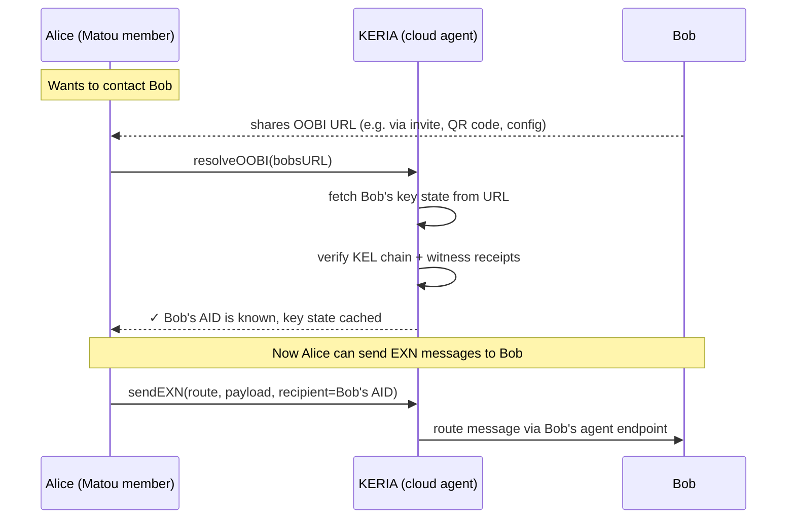

No central address book. No directory. Just URLs and cryptographic verification.

---

### ACDC Credentials

**ACDC** (Authentic Chained Data Containers) is the KERI-native credential format. Delivered via **IPEX** (Issuance and Presentation Exchange):

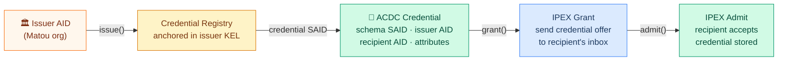

Credentials are **anchored in the issuer's KEL** — if keys are stolen, any fraudulent issuances can be detected because they won't appear in the legitimate KEL.

---

## Part 2 — KERIA: the Cloud Agent

### The Signify / KERIA Split

This is the most important thing to understand. **Keys never leave the device.**

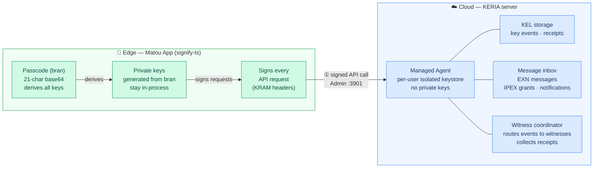

KERIA knows _what_ happened (your KEL, credentials, messages) but cannot act on your behalf without your signed instructions. One KERIA instance hosts thousands of independent, isolated agents.

---

### KERIA's Three APIs

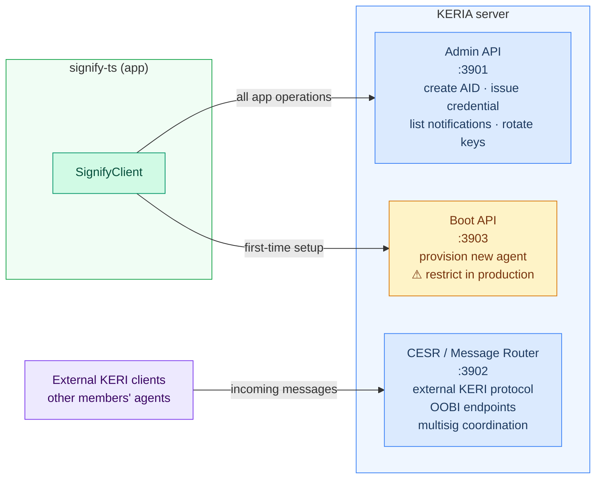

---

## Part 3 — How Matou Uses KERI

### Full Stack Architecture

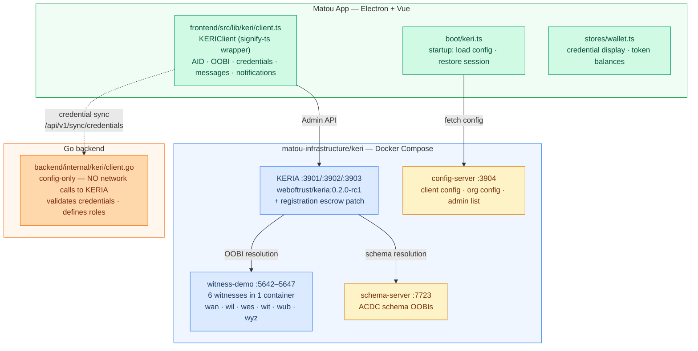

**Key design principle**: the Go backend never talks directly to KERIA. All cryptographic operations happen in the frontend via signify-ts. The backend is purely a validation and storage layer.

---

### App Startup Sequence

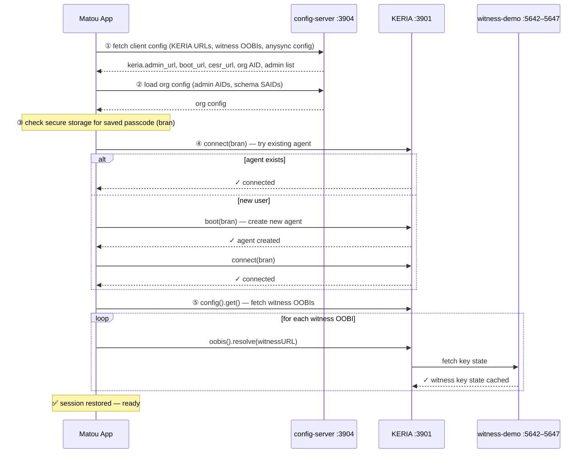

---

### Registration Flow (new member applying)

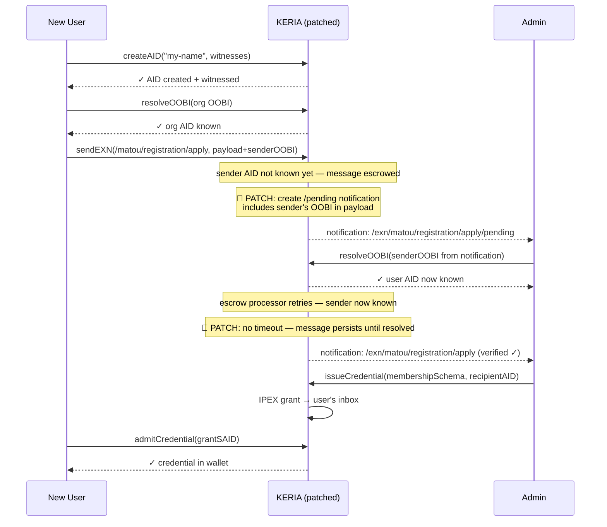

---

### Claim Identity Flow (invited member)

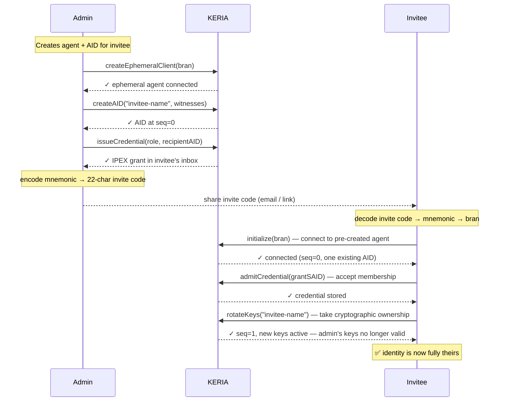

---

### The KERIA Registration Patch

Standard KERIA drops messages from unknown senders after 10 seconds. Matou monkey-patches three methods of keripy's `Exchanger` class at startup:

```mermaid
graph TD
    subgraph Standard["❌ Standard KERIA — broken for registration"]
        S1["User sends registration"]
        S2["Sender AID unknown<br>→ message escrowed"]
        S3["10 second timeout<br>→ message DROPPED"]
        S4["Admin never sees it"]
        S1 --> S2 --> S3 --> S4
    end

    subgraph Patched["✅ Patched KERIA — registration works"]
        P1["User sends registration<br>(includes senderOOBI in payload)"]
        P2["Sender AID unknown<br>→ message escrowed"]
        P3["PATCH ①<br>create /pending notification<br>with senderOOBI embedded"]
        P4["Admin sees pending registration<br>resolves sender's OOBI"]
        P5["PATCH ②<br>no timeout — message persists<br>escrow retries periodically"]
        P6["Sender now known<br>message processes"]
        P7["PATCH ③<br>create verified notification<br>for known-sender routes"]
        P1 --> P2 --> P3 --> P4 --> P5 --> P6 --> P7
    end

    style Standard fill:#fff1f2,stroke:#ef4444
    style Patched fill:#f0fdf4,stroke:#16a34a
    style S1 fill:#fca5a5,stroke:#ef4444,color:#7f1d1d
    style S2 fill:#fca5a5,stroke:#ef4444,color:#7f1d1d
    style S3 fill:#fca5a5,stroke:#ef4444,color:#7f1d1d
    style S4 fill:#fca5a5,stroke:#ef4444,color:#7f1d1d
    style P1 fill:#d1fae5,stroke:#059669,color:#064e3b
    style P2 fill:#fef3c7,stroke:#d97706,color:#78350f
    style P3 fill:#d1fae5,stroke:#059669,color:#064e3b
    style P4 fill:#dbeafe,stroke:#3b82f6,color:#1e3a5f
    style P5 fill:#d1fae5,stroke:#059669,color:#064e3b
    style P6 fill:#d1fae5,stroke:#059669,color:#064e3b
    style P7 fill:#d1fae5,stroke:#059669,color:#064e3b
```

---

## Part 4 — Current Witness Setup

### What You Actually Have Today

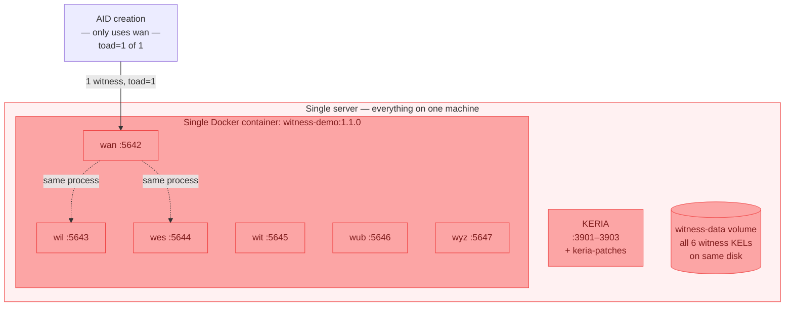

**If this server goes down**: KERIA goes down (no one can sign events or receive messages), and all 6 witnesses go down together (no key events can be anchored). This is **zero resilience** — it's a development setup.

---

## Part 5 — KERI Distributed Deployment

### Witnesses vs KERIA — Two Separate Resilience Concerns

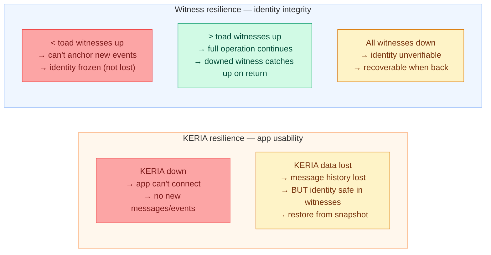

**The key insight**: if KERIA's database is lost but witnesses are alive, identities can be fully reconstructed. Users re-initialize with their mnemonic, KERIA re-fetches witness receipts. Only message history and notifications are lost, not identities.

---

### How Witness Replication Actually Works

Unlike any-sync where nodes actively replicate to each other, KERI witnesses receive events **pushed from the controller** at the time of signing. There is no background gossip between witnesses.

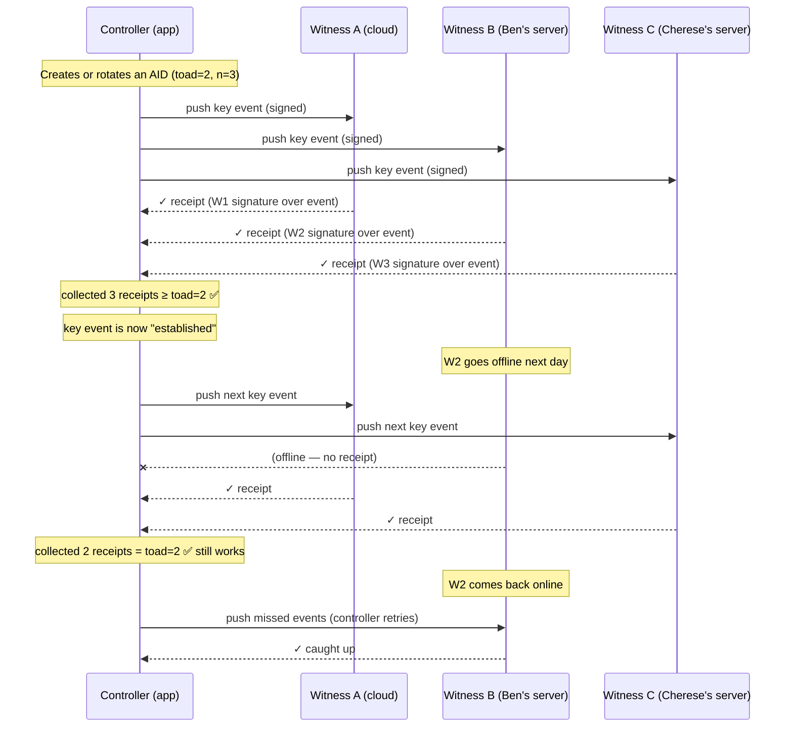

---

### Recommended Production Topology

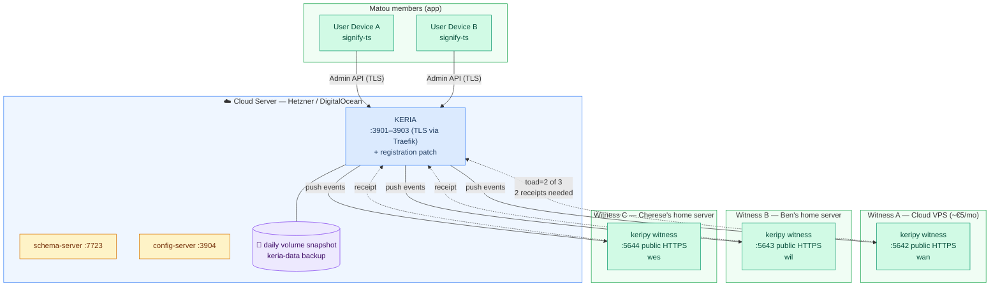

---

### One Witness Goes Down — Still Works

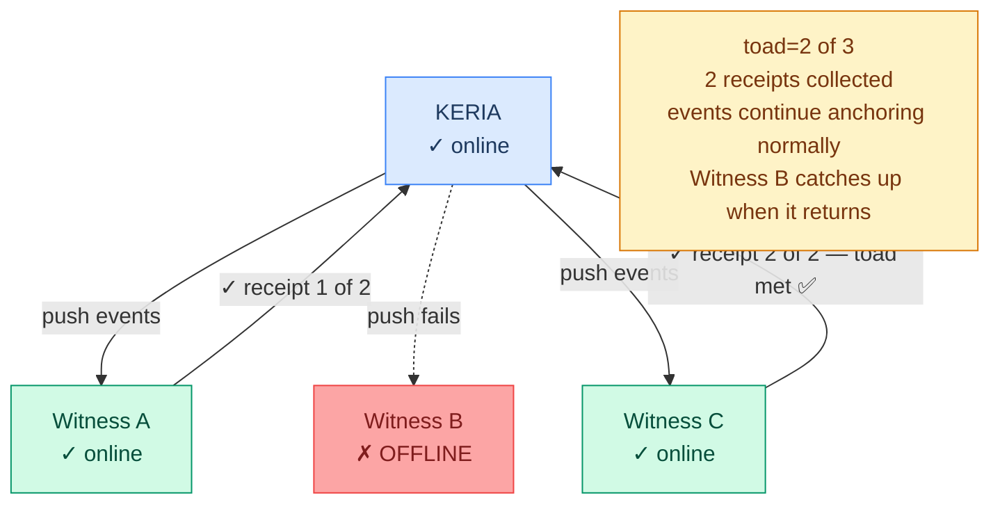

**Impact on users:** None. ✅ They don't even know a witness is down.

---

### KERIA Goes Down (Witness Resilience Holds)

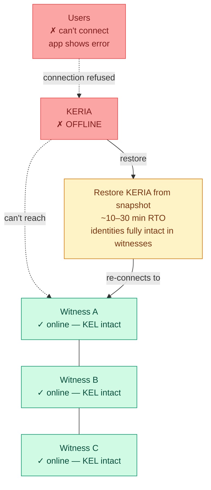

**Impact on users:** Can't use the app until KERIA is restored. Identities (KELs) are safe. Message history may be partially lost if snapshot was >24h old.

---

### Deployment Option Comparison

| Option | Resilience | Cost/mo | What fails |
|---|---|---|---|
| **Current** (dev) | ❌ None | $0 | Everything if server down |
| **Starter** (1 server + snapshot) | 🟡 Low | ~$15 | ~30min RTO on server loss |
| **Recommended** (1 KERIA + 3 witnesses) | 🟢 Good | ~$30–50 | 1 witness can fail; KERIA single point |
| **Robust** (+ cold standby KERIA) | 🟢 High | ~$60–100 | 2 witnesses can fail; KERIA ~10min RTO |
| **Full HA** (load-balanced KERIA + 5 witnesses) | 🟢 Very high | ~$200+ | Requires shared storage / KERIA clustering |

---

## Part 6 — Quick Reference

### Service Ports

| Service | Port | Purpose |
|---|---|---|
| KERIA Admin | 3901 | All Signify client calls |
| KERIA CESR | 3902 | External KERI protocol / OOBI endpoints |
| KERIA Boot | 3903 | Agent provisioning (restrict in production) |
| Config Server | 3904 | Client + org config |
| Witness wan | 5642 | HTTP OOBI |
| Witness wil | 5643 | HTTP OOBI |
| Witness wes | 5644 | HTTP OOBI |
| Witness wit | 5645 | HTTP OOBI |
| Witness wub | 5646 | HTTP OOBI |
| Witness wyz | 5647 | HTTP OOBI |
| Schema Server | 7723 | ACDC schema OOBI endpoints |

### Key Files

| File | What it is |
|---|---|
| `keri/keria-config.json` | KERIA bootstrap: CESR URL + witness OOBIs to pre-resolve |
| `keri/witness-config/wan.json` | Witness `wan` config: its own curl + peer iurls |
| `keri/docker-compose.yml` | Dev stack |
| `keri/docker-compose.prod.yml` | Production Traefik TLS overrides |
| `keria-patches/exchanger_patch.py` | Registration escrow patch (3 monkey-patches) |
| `keria-patches/start_keria.py` | Patched entrypoint — applies patches before starting KERIA |
| `frontend/src/lib/keri/client.ts` | All frontend KERI operations (signify-ts wrapper, ~1400 lines) |
| `frontend/src/boot/keri.ts` | App startup: config load, session restore |
| `backend/internal/keri/client.go` | Backend: credential validation + role definitions (no KERIA calls) |

### Terminology

| Term | Plain English |
|---|---|
| AID | Your decentralised identity (like a DID) |
| KEL | Tamper-proof history of your identity's key events |
| KERIA | Cloud agent: your identity's always-on server (holds KEL, inbox, message routing) |
| signify-ts | Edge wallet: runs in the app, holds private keys, signs everything |
| Witness | Independent server that receipts key events — the replication layer |
| TOAD | Minimum number of witness receipts needed to anchor a key event |
| OOBI | URL to discover another party's key state |
| ACDC | KERI-native credential format |
| IPEX | Protocol for issuing and accepting credentials |
| EXN | Exchange message — arbitrary peer-to-peer message between AIDs |
| bran | The 21-char passcode that derives all agent keys |
| mnemonic | 12-word BIP39 recovery phrase (derives the bran) |
| TOAD=2 of 3 | Any 2 of 3 witnesses must receipt an event — tolerates 1 failure |
