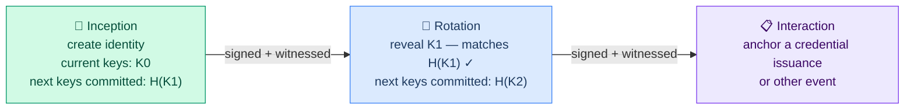
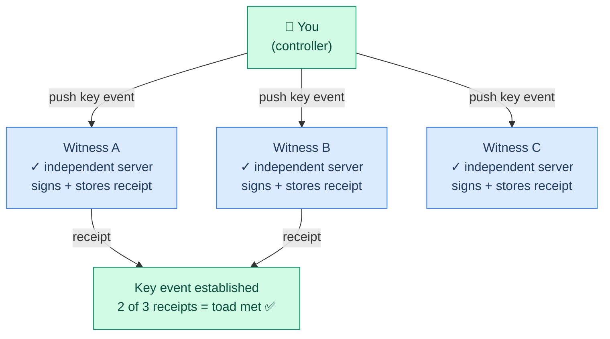
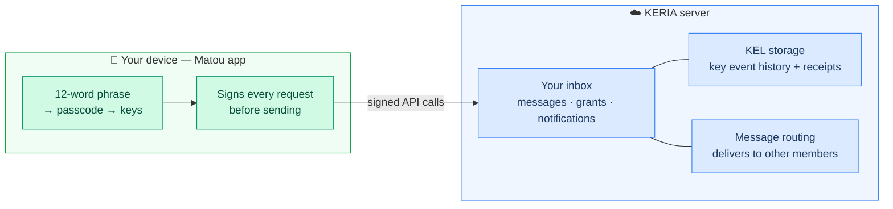
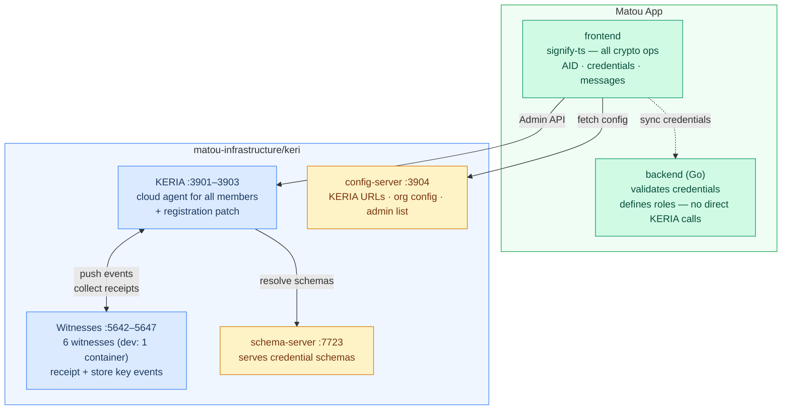
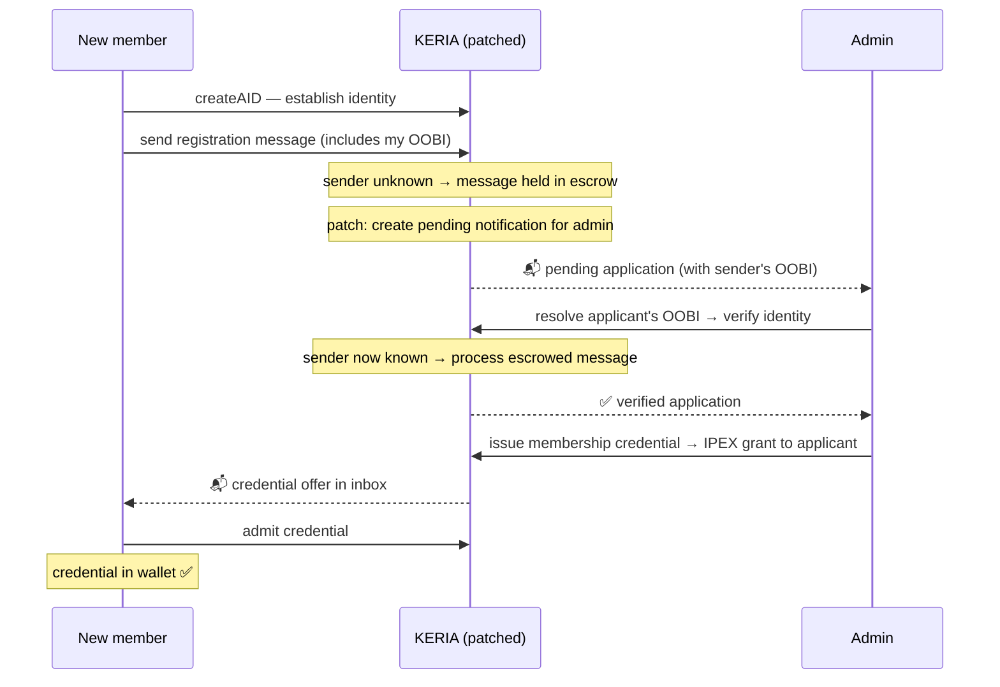
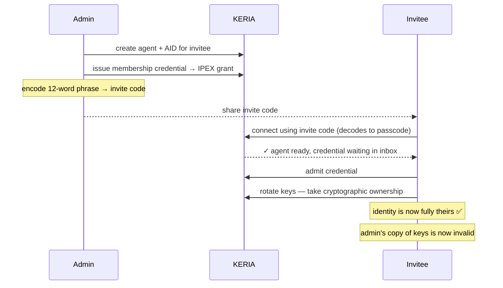

# KERI & KERIA — How It Works and How Matou Uses It

This document explains KERI from first principles, then shows how Matou's infrastructure uses it. It covers identities, witnesses, the cloud agent, and what happens during registration and onboarding

---

## Part 1 — KERI Concepts

### What is KERI?

KERI (Key Event Receipt Infrastructure) is a protocol for proving who you are on the internet without needing a central authority — no Google, no government, no blockchain. Your identity is a cryptographic keypair that you and only you control.

If you know Scuttlebutt, KERI will feel familiar. In SSB your identity is your keypair and your feed is an append-only signed log. KERI is the same shape — but it solves the one thing SSB never could: **key rotation**. In SSB, if you lose your private key, your identity is gone forever. In KERI you can swap out a compromised key and your identity survives intact, because when you create an identity you secretly commit to the hash of your *next* keys before you ever need them. If your current key is stolen, you reveal the pre-committed next key, prove it matches the hash you published earlier, and continue — all your history and credentials remain valid.

---

### Your Identity — the AID and KEL

Your identity in KERI is called an **AID** (Autonomic Identifier). Every AID has a **KEL** (Key Event Log) — an append-only, cryptographically chained history of everything that's happened to your identity: when it was created, when keys were rotated, when credentials were issued.

Think of the KEL like a git commit history for your identity. Each event is signed by your current keys and references the hash of the previous event, so the chain can't be tampered with retroactively. The KEL is public — anyone can read it to verify your current key state.

---

### Witnesses — Independent Notaries

Witnesses are independent servers that each keep their own copy of your KEL and sign receipts confirming your key events happened. They're like a panel of independent notaries — each one separately verifies and stamps every event.

Why does this matter? If someone steals your private key and tries to quietly rotate your identity, they'd have to get all your witnesses to sign off on their fraudulent version while you're simultaneously signing the real version. The witnesses end up with conflicting records, and the attack is detectable.

The number of witness receipts required before a key event is considered established is called the **toad** (threshold of accountable duplicity). With 3 witnesses and a toad of 2, any one witness can be offline or compromised and your identity still works fine.

---

### OOBIs — How People Find Each Other

An **OOBI** (Out-of-Band Introduction) is just a URL that lets one party discover another's current key state. There's no central address book — you share your OOBI with someone via an invite link, a QR code, or a config file, and their system fetches and verifies your key state from it.

In Matou, the org's OOBI is baked into the app config. When a new member registers, they include their own OOBI in the registration message so admins can resolve who they are.

---

### Credentials — ACDC and IPEX

KERI has a built-in credential format called **ACDC** (Authentic Chained Data Containers). A credential is issued by one AID to another, signed by the issuer's current keys, and anchored in the issuer's KEL. Anchoring is what makes the system safe: if someone steals the issuer's keys and tries to issue fraudulent credentials, those credentials won't appear in the legitimate KEL history and can be detected.

Credentials are delivered via **IPEX** — the exchange protocol. The issuer sends a *grant* to the recipient's inbox. The recipient *admits* it, and the credential appears in their wallet. Either party can decline.

---

## Part 2 — KERIA: the Cloud Agent

### Keys Never Leave the Device

KERIA is a Python server that acts as your identity's always-on online presence — but it **never holds your private keys**. This is the single most important thing about the architecture.

Think of the split like this: signify-ts (running inside the Matou app on your device) is your key manager. KERIA is your online mailbox and identity server. Every request the app sends to KERIA is signed on your device before it leaves. KERIA can see what happened to your identity, but it cannot act on your behalf without a signed instruction from you.

When you first open the app, it connects to KERIA and says "boot me an agent with this passcode." KERIA creates an isolated slot for you — your mailbox — identified by a derivative of your passcode, not your keys. One KERIA server can host thousands of these isolated agents, each completely independent.

---

## Part 3 — Matou's Infrastructure

### The Services

Matou runs four services as a Docker Compose stack:

**KERIA** manages every member's agent — their KEL, their inbox, their pending messages, their credentials. The app talks to KERIA for almost everything identity-related.

**Witnesses** receipt and store key events. In the dev setup all six witnesses run in a single container (the `witness-demo` image that WebOfTrust ships for testing). In production they'd each run on separate servers.

**The schema server** serves the ACDC credential schemas as OOBIs. KERIA resolves these when issuing or verifying credentials.

**The config server** is how the app bootstraps — it fetches KERIA's URLs, the org AID, the admin list, and the AnySync config all in one call on startup.

The **Go backend** is notable for what it *doesn't* do: it has no direct connection to KERIA. All cryptographic operations happen in the frontend. The backend validates credential structure and defines the role/permission system, but signing always happens on the user's device.

---

### Registration — a New Member Applying

When someone applies to join Matou, the app creates an AID for them, then sends a registration message to each admin's KERIA inbox. The message includes the applicant's OOBI so admins can verify who they are.

Standard KERIA would silently drop this message after 10 seconds because the sender is unknown. Matou's patched version holds the message indefinitely and creates a "pending" notification for the admin — so admins see the application even if the applicant's OOBI hasn't been resolved yet.

---

### Onboarding — an Admin Inviting Someone

The other path into Matou is a direct invite. The admin creates an agent and AID on behalf of the invitee, issues them a credential, then encodes the invitee's recovery phrase as a short invite code to share with them.

The key rotation at the end is what makes this secure. Until the invitee rotates, the admin technically has the keys. The moment the invitee rotates, those keys are superseded and only the invitee holds the current valid keys.

---

## Part 4 — Failure Scenarios

### A witness goes offline

With toad=2 and 3 witnesses, one witness can go down completely with no impact on members. Key events keep getting anchored using the remaining two witnesses. When the downed witness comes back, it catches up automatically.

**Impact:** None to users. ✅

---

### KERIA goes down

If KERIA goes down, members can't use the app — it can't connect to their agent. However, their identities are completely safe. Each witness still holds the full KEL. When KERIA is restored from a snapshot, it reconnects to the witnesses and everything is intact. If KERIA's database were lost entirely, members can re-initialize with their 12-word phrase and KERIA rebuilds from the witnesses — only message history and notification queue would be lost.

**Impact:** App unusable until KERIA restored. Identities safe. ⚠️

---

### Summary

| What | Role | If it goes down |
|---|---|---|
| **signify-ts (app)** | Signs everything — holds your keys | Device-specific; other devices unaffected |
| **KERIA** | Online mailbox + KEL storage + routing | App unusable; identities safe in witnesses |
| **Witnesses** | Receipt + store key events | 1 of 3 down: no impact (toad=2). All down: can't anchor new events |
| **Config server** | Bootstrap config on startup | App can't start fresh; existing sessions continue |
| **Schema server** | Serve credential schemas | Can't issue new credentials until restored |